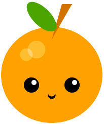

## أضف فم

الفم هو وسيلة رائعة لإظهار المشاعر. هل سيكون لشخصيتك ابتسامة أو عبوس أو أي شيء آخر؟ 

{:width="200px"}

--- task ---

فكر في نوع الفم الذي يحتاجه وجهك. أبسط فم سيكون عبارة عن دائرة تبدو متفاجئة.

يمكنك إضافة دائرتين متداخلتين لإنشاء ابتسامة أو عبوس. يمكن إضافة مثلثات أو مستطيلات للأسنان.

--- /task ---

--- task ---

أضف تعليمة برمجية إلى دالة `draw()` لرسم وجه أو قناع.

--- collapse ---

---
title: اصنع فمًا من الدوائر المتداخلة
---

اضبط لون `ملء` لفمك ثم ارسم `شكل بيضوي`. اضبط لون `تعبئة` مرة أخرى ، هذه المرة لمطابقة لون الوجه ، ثم ارسم `شكل ييضوي` ثانوي.

قم بتغيير إحداثيات `y` `للشكل البيضوي` الثاني إلى موضع أعلى قليلاً للابتسامة أو وضع أقل قليلاً للتعبير عن العبوس.

--- code ---
---
language: python
filename: main.py - draw()
---

    fill(0, 0, 0) #فم أسود
    ellipse(200, 240, 15, 15)
    fill(255, 165, 0) #وجه برتقالي
    ellipse(200, 235, 15, 15) #دائرة أعلى

--- /code ---

--- code ---
---
language: python
filename: main.py - draw()
---

    fill(0, 0, 0) #فم أسود
    ellipse(200, 240, 15, 15)
    fill(255, 165, 0) #وجه برتقالي
    ellipse(200, 245, 15, 15) #الدائرة السفلية

--- /code ---

--- /collapse ---

--- collapse ---

---
title: اصنع فمًا باستخدام المستطيلات
---

غالبًا ما تظهر الروبوتات مع أفواه `مستطيلة`. في بعض الأحيان ، يتم استخدام أشكال `مستطيل` و `شكل بيضوي` معًا لإنشاء رمز تعبيري كشر أو لإضافة قناع وجه.

أضف رمز `المستطيل`، ثم أنشئ`مستطيلاً` أصغر حجمًا بداخله. قم بتغيير `stroke` و`fill`ألوان لاستكمال المظهر الخاص بك. أضف`شكل بيضاوي` إذا لزم الأمر.

**نصيحة:** تذكر وضع `أشكال بيضاوية` فوق كود `مستطيل` إذا كنت تريدهم أن يسيروا خلف الأشكال `مستطيل`.

--- code ---
---
language: python
filename: main.py - draw()
---
#قناع الوجه
no_fill()    
stroke(255, 255, 255)     
ellipse(150, 250, 30, 30) #حلقة الأذن اليسرى    
ellipse(250, 250, 30, 30) #حلقة الأذن اليمنى    
fill(255, 255, 255)    
no_stroke()     
rect(150, 230, 100, 40) #مستطيل أبيض كبير    
fill(108, 200, 206)    
rect(152, 235, 96, 30) #مستطيل أزرق أصغر

--- /code ---

--- /collapse ---

**نصيحة:** أضف تعليق `#فم` على السطر قبل رمز الفم لمساعدتك في العثور بسهولة على رمز الفم.

--- /task ---

--- task ---

**اختر:** يمكنك أيضًا إضافة أسنان متعددة إلى فمك باستخدام `ترجم` لتغيير إحداثيات `×` بعد سحب كل سن.

--- collapse ---

---
title: استخدم حلقة لإضافة صف من الأسنان
---

أضف تعليمة برمجية لإنشاء حلقة `مقابل` تتكرر لإنشاء عدد الأسنان التي تحتاجها.

بعد سحب كل سن ، أضف الكود إلى `translate()` بعرض السن.

يمكنك أيضًا إضافة رمز لتغيير لون كل سن.

--- code ---
---
language: python
filename: main.py - draw()
---

#فم
fill(90, 110, 184)     
red = 90 #مقدار البداية من الأحمر   
green = 110 #مقدار البداية من الاخضر    
blue = 180 #مقدار البداية من الازرق    
for i in range (0,6):     
rect(100, 300, 33, 50)     
fill(red, green, blue) #يستخدم المتغيرات للتحكم في تغيير اللون في كل حلقة    
red = red+40     
blue = blue-30     
translate(33, 0) #تحرك على طول الإحداثي x بعرض السن

--- /code ---

--- /collapse ---

[[[processing-translation]]]

--- collapse ---

---
title: استخدم المثلثات لإضافة الأنياب
---

قم بإنشاء مستطيل `` لاستخدامه كخط للفم.

أضف شكلين `مثلث` لإنشاء الأنياب. قم بتغيير إحداثيات `×` لكل زاوية لوضع الأنياب على طرفي نقيض من خط الفم.

--- code ---
---
language: python
filename: main.py - draw()
---
# فم
  fill(0)    
  rect(170, 260, 60, 5) #خط الفم    
  fill(0)    
  triangle(170, 260, 180, 280, 190, 260) #السن الايسر    
  triangle(210, 260, 220, 280, 230, 260) #السن الأيمن    
--- /code ---

--- /collapse ---

--- /task ---

--- task ---

**تصحيح:** قد تجد بعض الأخطاء في مشروعك والتي تحتاج إلى إصلاحها. فيما يلي بعض الأخطاء الشائعة.

--- collapse ---

---
title: شكلي المتداخل يخرج من الوجه
---

إذا كنت تستخدم شكلين متداخلين لإنشاء فم ، فأنت بحاجة إلى التأكد من أن الشكل الذي هو نفس لون الوجه لا يخرج عن الوجه. إذا حدث ذلك ، فقم بتغيير عرض الشكل أو ارتفاعه بحيث يكون صغيرًا بما يكفي ليلائم الوجه.

--- /collapse ---

--- collapse ---

---
title: لدي الكثير من الأسنان
---

لا تنس أن النطاق `()` ينشئ سلسلة من الأرقام تبدأ من 0 وليس 1. قد يحدث هذا فرقًا في التعليمات البرمجية الخاصة بك اعتمادًا على كيفية وضع أسنانك.

--- /collapse ---

--- /task ---

--- save ---
