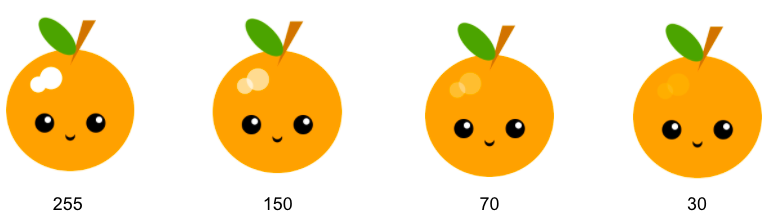

## أضف المزيد من التفاصيل

هل يحتاج وجهك أو قناعك إلى مزيد من التفاصيل لجعله أكثر تشويقًا؟ 

! [صورة تظهر وجه كمثال مع ملحق عصابة رأس.] (images / frida.png) {: width = "200px"}

--- task ---

يمكنك استخدام المزيد من الأشكال لإضافة المزيد من الميزات إلى وجهك أو قناعك.

كيف يمكنك إعطاء الوجه المزيد من الشخصية؟

يمكنك إضافة:

+ أنف
+ الحاجبين
+ آذان
+ الخدين
+ يسلط الضوء / الأضواء
+ ايا كان ما تحب!

ما عليك سوى إضافة التفاصيل الإضافية التي تناسب الرسم.

--- /task ---

--- task ---

يمكنك إنشاء ألوان شفافة جزئيًا عن طريق إضافة رقم رابع إلى لون RGB لإعطاء "عتامة".

يرسم هذا الرمز النقاط البارزة المتداخلة في مثال فاكهة الكيوي:

--- code ---
---
language: python
filename: main.py - draw()
---

    #تسليط الضوء 
      fill(255, 255, 255, 70) #الدرجة 70 هي للشفافية / العتامة هنا 
      ellipse(170, 150, 35, 35) 
      ellipse(150, 160, 25, 25)

--- /code ---

--- /task ---

--- save ---
