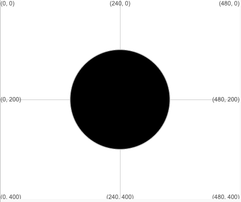

## Siâp y wyneb

Lluniwch a lliwio siâp ar gyfer eich wyneb neu fasg. Peidiwch ag ychwanegu'r nodweddion eraill eto, byddwch chi'n gwneud hynny nes 'mlaen.

{:width="200px"}

--- task ---

Penderfynwch ar brif siâp y wyneb ar gyfer eich masg. Fe allai fod yn gylch, yn elips, yn betryal, neu'n driongl hyd yn oed.

Ychwanegwch god at y swyddogaeth `draw()` i lunio wyneb neu fasg. Cofiwch dynnu `pass` o du mewn y swyddogaeth hefyd.

Mae'r enghraifft hon yn llunio cylch yn y canol, ond chi sydd i benderfynu pa siâp i'w ddefnyddio.

--- code ---
---
language: python
filename: main.py - draw()
line_numbers: true
line_number_start: 11
line_highlights: 12
---

def draw():   
  ellipse(width/2, height/2, 200, 200) #Cylch yn y canol

--- /code ---

[[[processing-python-ellipse]]]

[[[processing-python-rect]]]

[[[processing-python-triangle]]]

--- /task ---

--- task ---

**Profi:** Rhedwch eich cod a'i newid i gael y maint a siâp wyneb o'ch dewis.

--- /task ---

--- task ---

Dewiswch liw strôc ar gyfer yr amlinell a lliw llenwi ar gyfer y brif ran o'r siâp.

[[[processing-stroke]]]

Os nad ydych chi eisiau amlinell, defnyddiwch `no_stroke()`.

--- code ---
---
language: python 
filename: main.py - draw() 
line_numbers: true 
line_number_start: 11
line_highlights: 13
---

def draw():
  stroke(0) #Fe allwch chi ddefnyddio no_stroke() hefyd 
  fill(255, 255, 0) #Melyn llachar
  ellipse(width/2, height/2, 200, 200) #Cylch yn y canol

--- /code ---

[[[generic-theory-simple-colours]]]

--- /task ---

--- task ---

**Profi:** Rhedwch eich cod a newid y lliw nes eich bod yn fodlon arno.

--- /task ---

--- save ---
