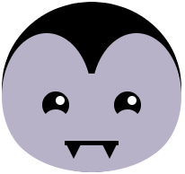

## Ychwanegu ceg

Mae ceg yn ffordd wych o ddangos emosiwn. Fydd eich cymeriad yn gwenu, yn gwgu, neu rywbeth arall? 

{:width="200px"}

--- task ---

Meddyliwch am ba fath o geg sydd ei hangen ar eich wyneb. Y geg symlaf fyddai cylch i edrych yn syn.

Fe allech chi ychwanegu dau gylch sy'n gorgyffwrdd i greu gwg neu wen. Byddai modd ychwanegu trionglau neu betryalau fel dannedd.

--- /task ---

--- task ---

Ychwanegwch god at eich swyddogaeth `draw()` i ychwanegu ceg.

--- collapse ---

---
title: Creu ceg gyda chylchoedd sy'n gorgyffwrdd
---

Gosodwch y lliw `fill` ar gyfer eich ceg ac yna llunio `ellipse`. Gosodwch y lliw `fill` eto, i gyfateb i liw'r wyneb y tro hwn, ac yna llunio ail `ellipse`.

Newidiwch gyfesuryn `y` yr ail `ellipse` i safle ychydig yn uwch i gael gwen neu ychydig yn is i gael gwg.

--- code ---
---
language: python
filename: main.py - draw()
---

    fill(0, 0, 0)  # A black mouth
    ellipse(200, 240, 15, 15)
    fill(255, 165, 0)  # An orange face
    ellipse(200, 235, 15, 15)  # Higher circle

--- /code ---

--- code ---
---
language: python
filename: main.py - draw()
---

    fill(0, 0, 0)  # A black mouth
    ellipse(200, 240, 15, 15)
    fill(255, 165, 0)  # An orange face
    ellipse(200, 245, 15, 15)  # Lower circle

--- /code ---

--- /collapse ---

--- collapse ---

---
title: Creu ceg gan ddefnyddio petryalau
---

Mae robotiaid yn cael eu dangos gyda chegau siâp petryal yn aml. Weithiau mae siapiau `rectangle` ac `ellipse` yn cael eu defnyddio gyda'i gilydd i greu emoji ystum neu i ychwanegu masg wyneb.

Ychwanegwch y cod ar gyfer `rectangle`, ac yna creu un llai tu mewn iddo. Newidiwch y lliwiau `stroke` a `fill` i gyflenwi eich thema. Ychwangewch siapiau `ellipse` os oes angen.

**Cyngor:** Cofiwch roi'r siapiau `ellipse` uwchben y cod `rectangle` os ydych chi am iddyn nhw fod tu ôl i'r siapiau `rectangle`.

--- code ---
---
language: python
filename: main.py - draw()
---

    # Face mask
    no_fill()
    stroke(255, 255, 255)
    ellipse(150, 250, 30, 30)  # Left ear loop
    ellipse(250, 250, 30, 30)  # Right ear loop
    fill(255, 255, 255)
    no_stroke()
    rect(150, 230, 100, 40)  # Large white rectangle
    fill(108, 200, 206)
    rect(152, 235, 96, 30)  # Smaller blue rectangle

--- /code ---

--- /collapse ---

**Tip:** Add a `#Mouth` comment on the line before your mouth code to help you easily find the mouth code.

--- /task ---

--- task ---

**Choose:** You could also add multiple teeth to your mouth using `translate` to change the `x` coordinate after each tooth is drawn.

--- collapse ---

---
title: Defnyddio dolen i ychwanegu rhes o ddannedd
---

Add code to create a `for` loop that repeats in order to create the number of teeth you need.

After each tooth has been drawn, add code to `translate()` it by the width of the tooth.

Ar ôl llunio pob dant, ychwanegwch god i'w `translate()` o led y dant.

--- code ---
---
language: python
filename: main.py - draw()
---

    # Mouth
    fill(90, 110, 184)
    red = 90  # Starting amount of red
    green = 110  # Starting amount of green
    blue = 180  # Starting amount of blue
    for i in range (0,6):
        rect(100, 300, 33, 50)
        fill(red, green, blue)  # Uses variables to control the colour change each loop
        red = red+40
        blue = blue-30
        translate(33, 0)  # Move along the x coordinate by the width of a tooth

--- /code ---

--- /collapse ---

[[[processing-translation]]]

--- collapse ---

---
title: Defnyddio trionglau i ychwanegu dannedd miniog
---

Create a `rectangle` to use as the line of the mouth.

Add two `triangle` shapes to create the fangs. Change the `x` coordinates for each corner to position the fangs at opposite ends of the mouth line.

--- code ---
---
language: python
filename: main.py - draw()
---

    # Mouth
    fill(0)
    rect(170, 260, 60, 5)  # Mouth line
    fill(0)
    triangle(170, 260, 180, 280, 190, 260)  # Left tooth
    triangle(210, 260, 220, 280, 230, 260)  # Right tooth
--- /code ---

--- /collapse ---

--- /task ---

--- task ---

**Debug:** You might find some bugs in your project that you need to fix. Here are some common bugs.

--- collapse ---

---
title: Mae fy siâp sy'n gorgyffwrdd yn ymestyn tu allan i'r wyneb
---

If you use two overlapping shapes to create a mouth, then you need to make sure the shape that is the same colour as the face doesn't go outside the face. If it does, then change the width or height of the shape so that it's small enough to fit inside the face.

--- /collapse ---

--- collapse ---

---
title: Mae gen i ormod o ddannedd
---

Don't forget that `range()` creates a sequence of numbers starting from 0 not 1. This may make a difference to your code depending on how you have positioned your teeth.

--- /collapse ---

--- /task ---

--- save ---
