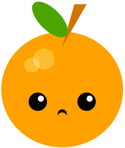

## Ychwanegu ceg

Mae ceg yn ffordd wych o ddangos emosiwn. Fydd eich cymeriad yn gwenu, yn gwgu, neu rywbeth arall? 

{:width="200px"}

--- task ---

Meddyliwch am ba fath o geg sydd ei hangen ar eich wyneb. Y geg symlaf fyddai cylch i edrych yn syn.

Fe allech chi ychwanegu dau gylch sy'n gorgyffwrdd i greu gwg neu wen. Byddai modd ychwanegu trionglau neu betryalau fel dannedd.

--- /task ---

--- task ---

Ychwanegwch god at eich swyddogaeth `draw()` i ychwanegu ceg.

--- collapse ---

---
title: Creu ceg gyda chylchoedd sy'n gorgyffwrdd
---

Gosodwch y lliw `fill` ar gyfer eich ceg ac yna llunio `ellipse`. Gosodwch y lliw `fill` eto, i gyfateb i liw'r wyneb y tro hwn, ac yna llunio ail `ellipse`.

Newidiwch gyfesuryn `y` yr ail `ellipse` i safle ychydig yn uwch i gael gwen neu ychydig yn is i gael gwg.

--- code ---
---
language: python
filename: main.py - draw()
---

    fill(0, 0, 0) #A black mouth
    ellipse(200, 240, 15, 15)
    fill(255, 165, 0) #An orange face
    ellipse(200, 235, 15, 15) #Higher circle

--- /code ---

--- code ---
---
language: python
filename: main.py - draw()
---

    fill(0, 0, 0) #A black mouth
    ellipse(200, 240, 15, 15)
    fill(255, 165, 0) #An orange face
    ellipse(200, 245, 15, 15) #Lower circle

--- /code ---

--- /collapse ---

--- collapse ---

---
title: Creu ceg gan ddefnyddio petryalau
---

Mae robotiaid yn cael eu dangos gyda chegau siâp petryal yn aml. Weithiau mae siapiau `rectangle` ac `ellipse` yn cael eu defnyddio gyda'i gilydd i greu emoji ystum neu i ychwanegu masg wyneb.

Ychwanegwch y cod ar gyfer `rectangle`, ac yna creu un llai tu mewn iddo. Newidiwch y lliwiau `stroke` a `fill` i gyflenwi eich thema. Ychwangewch siapiau `ellipse` os oes angen.

**Cyngor:** Cofiwch roi'r siapiau `ellipse` uwchben y cod `rectangle` os ydych chi am iddyn nhw fod tu ôl i'r siapiau `rectangle`.

--- code ---
---
language: python
filename: main.py - draw()
---
# Masg wyneb
no_fill()    
stroke(255, 255, 255)     
ellipse(150, 250, 30, 30) #Left ear loop    
ellipse(250, 250, 30, 30) #Right ear loop    
fill(255, 255, 255)    
no_stroke()     
rect(150, 230, 100, 40) #Large white rectangle    
fill(108, 200, 206)    
rect(152, 235, 96, 30) #Smaller blue rectangle

--- /code ---

--- /collapse ---

**Cyngor:** Ychwanegwch sylw `#Ceg` ar y llinell cyn eich cod ceg i'ch helpu chi i ddod o hyd i'r cod ceg yn hawdd.

--- /task ---

--- task ---

**Dewis:** Fe allech chi hefyd ychwanegu nifer o ddannedd at eich ceg gan ddefnyddio `translate` i newid y cyfesuryn `x` ar ôl llunio pob dant.

--- collapse ---

---
title: Defnyddio dolen i ychwanegu rhes o ddannedd
---

Ychwanegwch god i greu dolen `for` sy'n ailadrodd mewn trefn i greu nifer y dannedd hoffech chi eu cael.

Ar ôl llunio pob dant, ychwanegwch god i'w `translate()` o led y dant.

Fe allwch chi ychwanegu cod i newid lliw pob dant hefyd.

--- code ---
---
language: python
filename: main.py - draw()
---

# Ceg
fill(90, 110, 184)     
red = 90 #Starting amount of red   
green = 110 #Starting amount of green    
blue = 180 #Starting amount of blue    
for i in range (0,6):     
rect(100, 300, 33, 50)     
fill(red, green, blue) #Uses variables to control the colour change each loop    
red = red+40     
blue = blue-30     
translate(33, 0) #Move along the x coordinate by the width of a tooth

--- /code ---

--- /collapse ---

[[[processing-translation]]]

--- collapse ---

---
title: Defnyddio trionglau i ychwanegu dannedd miniog
---

Ewch ati i greu `rectangle` i'w ddefnyddio fel llinell y geg.

Ychwanegwch ddau siâp `triangle` i greu'r dannedd miniog. Newidiwch y cyfesurynnau `x` ar gyfer pob cornel i leoli'r dannedd miniog ar ddwy ochr y geg.

--- code ---
---
language: python
filename: main.py - draw()
---
# Ceg
  fill(0)    
rect(170, 260, 60, 5) #Mouth line    
fill(0)    
triangle(170, 260, 180, 280, 190, 260) #Left tooth    
triangle(210, 260, 220, 280, 230, 260) #Right tooth    
--- /code ---

--- /collapse ---

--- /task ---

--- task ---

**Difa chwilod:** Efallai bydd angen i chi drwsio chwilod yn eich prosiect. Dyma rai chwilod cyffredin.

--- collapse ---

---
title: Mae fy siâp sy'n gorgyffwrdd yn ymestyn tu allan i'r wyneb
---

Os ydych chi'n defnyddio dau siâp sy'n gorgyffwrdd i greu ceg, rhaid i chi wneud yn siŵr nad yw'r siâp sydd yr un lliw â'r wyneb yn ymestyn tu allan i'r wyneb. Os yw hynny'n digwydd, newidiwch led neu uchder y siâp fel ei fod yn ddigon bach i ffitio tu mewn i'r wyneb.

--- /collapse ---

--- collapse ---

---
title: Mae gen i ormod o ddannedd
---

Cofiwch fod `range()` yn creu dilyniant o rifau'n dechrau o 0, nid 1. Fe allai hyn wneud gwahaniaeth i'ch cod yn dibynnu ar sut rydych chi wedi lleoli eich dannedd.

--- /collapse ---

--- /task ---

--- save ---
