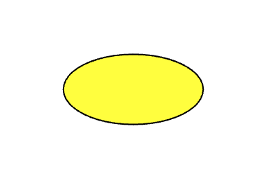

## Kreise und Ovale

Zeichne und färbe eine Form für dein Gesicht oder deine Maske.

Eine **Ellipse** ist eine ovale Form. Wenn du die gleiche Breite und Höhe angibst, zeichnest du einen Kreis.

--- task ---

Füge der Funktion `draw()` Code hinzu, um die Füllfarbe mit Rot-, Grün- und Blauwerten festzulegen, genau wie du es für den Hintergrund getan hast.

Zeichne dann einen Kreis in dieser Farbe.

--- code ---
---
language: python
line_numbers: true
line_number_start: 12
line_highlights: 16-22
---

def draw():
    # Füge hier den Code ein, der bei jedem Frame ausgeführt werden soll
    background(255, 255, 255)  
    # Füge hier den Code hinzu, um dein Gesicht zu zeichnen
    fill(255, 255, 0) 
    ellipse(
        bildschirm_groesse/2, 
        bildschirm_groesse/2, 
        200, 
        200
    )  
  
--- /code ---

--- /task ---

--- task ---

**Test:** Führe deinen Code aus und du solltest einen farbigen Kreis sehen.

--- /task ---

--- task ---

Ändere die Werte für Breite und Höhe, um zu sehen, wie die Ellipse ihre Form ändert.

--- code ---
---
language: python
line_numbers: true
line_number_start: 10
line_highlights: 18-19
---

def draw():
    # Füge hier den Code ein, der bei jedem Frame ausgeführt werden soll
    background(255, 255, 255)  
    # Füge hier den Code hinzu, um dein Gesicht zu zeichnen
    fill(255, 255, 0) 
    ellipse(
        bildschirm_groesse/2, 
        bildschirm_groesse/2, 
        100, # width
        50   # height
    )  
  
--- /code ---

--- /task ---

--- task ---

Vor dem Code, in dem du die Ellipse zeichnest, kannst du eine Farbe und Dicke festlegen.

--- code ---
---
language: python
line_numbers: true
line_number_start: 14
line_highlights: 15-16
---
    fill(255, 255, 0) 
    stroke(255, 255, 255)  
    stroke_weight(3)
    ellipse(
        bildschirm_groesse/2, 
        bildschirm_groesse/2, 
        100, 
        50
    )  
    
--- /code ---

Alternativ kannst du den Strich auch entfernen, sodass du keine Kontur hast.

--- code ---
---
language: python
line_numbers: true
line_number_start: 14
line_highlights: 15
---
    fill(255, 255, 0) 
    no_stroke()
    ellipse(
        bildschirm_groesse/2, 
        bildschirm_groesse/2, 
        100, 
        50
    )  
  
--- /code ---

--- /task ---

--- task ---

**Test:** Experimentiere mit dem Ändern oder Entfernen der Strichfarbe und -stärke und führe dann deinen Code aus, um die Ergebnisse anzuzeigen.

--- /task ---