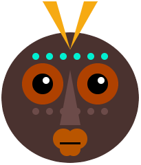

## Εισαγωγή

Γράψε κώδικα στην Python για να ζωγραφίσεις ένα πρόσωπο ή μάσκα, χρησιμοποιώντας γεωμετρικά σχήματα.

Η δημιουργία της **γεωμετρικής τέχνης** χρονολογείται από την Αρχαία Ελλάδα, όπου τα βάζα βάφονταν με σχέδια που αποτελούνται από σχήματα. Οι καλλιτέχνες άρχισαν να χρησιμοποιούν σχήματα για να σχεδιάζουν ανθρώπους και ζώα με κύκλους για κεφάλια, τρίγωνα σώματα και γραμμές για πόδια και χέρια.

Θα χρειαστεί να:

+ Χρησιμοποιήσεις τον κώδικα δημιουργικά για να φτιάξεις ένα έργο ψηφιακής τέχνης
+ Σχεδιάσεις και τοποθετήσεις την τέχνη σου χρησιμοποιώντας γεωμετρικά σχήματα, συντεταγμένες και επίπεδα
+ Οργανώσεις τον κωδικό σου με συναρτήσεις

--- no-print ---

### Πάρε έμπνευση

Θα λάβεις κάποιες σχεδιαστικές αποφάσεις σχετικά με το είδος του προσώπου που θα κάνεις και πώς θα χρησιμοποιήσεις κώδικα για να έχεις τα εφέ που θέλεις.

--- task ---

Look at these examples and think about how they have been made from circles, ellipses, squares, rectangles, and triangles.

**Kawaii fruit**:
<iframe src="https://editor.raspberrypi.org/en/embed/viewer/fruit-face-example" width="400" height="710" frameborder="0" marginwidth="0" marginheight="0" allowfullscreen>
</iframe> [See inside](https://editor.raspberrypi.org/en/projects/fruit-face-example){:target="_blank"}

**Stacked faces**:
<iframe src="https://editor.raspberrypi.org/en/embed/viewer/stacked-faces-example" width="400" height="710" frameborder="0" marginwidth="0" marginheight="0" allowfullscreen>
</iframe> [See inside](https://editor.raspberrypi.org/en/projects/stacked-faces-example){:target="_blank"}

**Tribal mask**:
<iframe src="https://editor.raspberrypi.org/en/embed/viewer/tribal-mask-example" width="400" height="710" frameborder="0" marginwidth="0" marginheight="0" allowfullscreen>
</iframe> [See inside](https://editor.raspberrypi.org/en/projects/tribal-mask-example){:target="_blank"}

--- /task ---

--- /no-print ---

--- print-only ---

### Get ideas 💭

You are going to make some design decisions about the kind of face you will make and how you will use code to get the effect you want.

Investigate the example projects above, see if you can identify the shapes used to make the faces. You can click **See inside** to view the code.

  

--- /print-only ---

