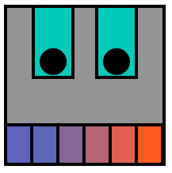

## Πρόσθεσε ένα στόμα

Ένα στόμα είναι ένας πολύ καλός τρόπος να δείξεις συναίσθημα. Ο χαρακτήρας σου θα έχει χαμόγελο, κατσούφιασμα ή κάτι άλλο; 

{:width="200px"}

--- task ---

Σκέψου τι είδους στόμα χρειάζεται το πρόσωπό σου. Το πιο απλό στόμα θα ήταν ένας κύκλος για να δείχνει έκπληκτο.

Θα μπορούσες να προσθέσεις δύο επικαλυπτόμενους κύκλους για να δημιουργήσεις ένα χαμόγελο ή ένα κατσούφιασμα. Θα μπορούσαν να προστεθούν τρίγωνα ή ορθογώνια για τα δόντια.

--- /task ---

--- task ---

Πρόσθεσε κώδικα στη συνάρτηση `draw()` για να προσθέσεις ένα στόμα.

--- collapse ---

---
title: Δημιούργησε ένα στόμα από επικαλυπτόμενους κύκλους
---

Όρισε το χρώμα για το στόμα σου με το `fill` και στη συνέχεια σχεδίασε μια `έλλειψη`. Ρύθμισε ξανά το χρώμα `fill`, αυτή τη φορά για να ταιριάζει με το χρώμα του προσώπου και, στη συνέχεια, σχεδίασε μια δεύτερη `έλλειψη`.

Άλλαξε τη συντεταγμένη `y` της δεύτερης `έλλειψης` σε μια ελαφρώς υψηλότερη θέση για ένα χαμόγελο ή μια ελαφρώς χαμηλότερη θέση για ένα κατσούφιασμα.

--- code ---
---
language: python
filename: main.py - draw()
---

    fill(0, 0, 0) #A black mouth
    ellipse(200, 240, 15, 15)
    fill(255, 165, 0) #An orange face
    ellipse(200, 235, 15, 15) #Higher circle

--- /code ---

--- code ---
---
language: python
filename: main.py - draw()
---

    fill(0, 0, 0) #A black mouth
    ellipse(200, 240, 15, 15)
    fill(255, 165, 0) #An orange face
    ellipse(200, 245, 15, 15) #Lower circle

--- /code ---

--- /collapse ---

--- collapse ---

---
title: Δημιούργησε ένα στόμα χρησιμοποιώντας ορθογώνια
---

Τα ρομπότ εμφανίζονται συχνά με `ορθογώνια` στόματα. Μερικές φορές σχήματα με `ορθογώνια` και `ελλείψεις` χρησιμοποιούνται μαζί για να δημιουργήσουν ένα emoji γκριμάτσας ή για να προσθέσουν μια μάσκα προσώπου.

Πρόσθεσε τον κώδικα για ένα `ορθογώνιο`και, στη συνέχεια, δημιούργησε ένα μικρότερο `ορθογώνιο` μέσα σε αυτό. Άλλαξε τα χρώματα του `stroke` και του `fill` για να συμπληρώσουν το θέμα σου. Πρόσθεσε σχήματα με `ελλείψεις` εάν χρειάζεται.

**Συμβουλή:** Θυμήσου να βάλεις τα σχήματα με τις `ελλείψεις` πάνω από τον κώδικα των `ορθογωνίων`, εάν θέλεις να πάνε πίσω από τα σχήματα των `ορθογωνίων`.

--- code ---
---
language: python
filename: main.py - draw()
---
# Μάσκα προσώπου
no_fill()    
stroke(255, 255, 255)     
ellipse(150, 250, 30, 30) #Left ear loop    
ellipse(250, 250, 30, 30) #Right ear loop    
fill(255, 255, 255)    
no_stroke()     
rect(150, 230, 100, 40) #Large white rectangle    
fill(108, 200, 206)    
rect(152, 235, 96, 30) #Smaller blue rectangle

--- /code ---

--- /collapse ---

**Συμβουλή:** Πρόσθεσε ένα σχόλιο `#Στόμα` στη γραμμή πριν από τον κώδικα σου για το στόμα για να σε βοηθήσει να βρεις εύκολα τον κώδικα για το στόμα.

--- /task ---

--- task ---

**Επίλεξε:** Μπορείς επίσης να προσθέσεις πολλά δόντια στο στόμα σου χρησιμοποιώντας το `translate` για να αλλάξεις τη συντεταγμένη `x` μετά την σχεδίαση του κάθε δοντιού.

--- collapse ---

---
title: Χρησιμοποίησε έναν βρόχο για να προσθέσεις μια σειρά από δόντια
---

Πρόσθεσε κώδικα για να δημιουργήσεις μια δομή επανάληψης `for` που επαναλαμβάνεται για να δημιουργήσεις τον αριθμό των δοντιών που χρειάζεσαι.

Αφού ζωγραφιστεί κάθε δόντι, πρόσθεσε τον κώδικα στην συνάρτηση `translate()` για να μετακινήσεις την οθόνη κατά το πλάτος του δοντιού.

Μπορείς επίσης να προσθέσεις κώδικα για να αλλάξεις το χρώμα κάθε δοντιού.

--- code ---
---
language: python
filename: main.py - draw()
---

# Στόμα
fill(90, 110, 184)     
red = 90 #Starting amount of red   
green = 110 #Starting amount of green    
blue = 180 #Starting amount of blue    
for i in range (0,6):     
rect(100, 300, 33, 50)     
fill(red, green, blue) #Uses variables to control the colour change each loop    
red = red+40     
blue = blue-30     
translate(33, 0) #Move along the x coordinate by the width of a tooth

--- /code ---

--- /collapse ---

[[[processing-translation]]]

--- collapse ---

---
title: Χρησιμοποίησε τρίγωνα για να προσθέσεις κυνόδοντες
---

Δημιούργησε ένα `ορθογώνιο` για να το χρησιμοποιήσεις ως γραμμή του στόματος.

Πρόσθεσε δύο σχήματα `triangle` για να δημιουργήσεις τους κυνόδοντες. Άλλαξε τις συντεταγμένες `x` για κάθε κορυφή του τριγώνου για να τοποθετήσεις τους κυνόδοντες στα απέναντι άκρα της γραμμής του στόματος.

--- code ---
---
language: python
filename: main.py - draw()
---
# Στόμα
  fill(0)    
rect(170, 260, 60, 5) #Mouth line    
fill(0)    
triangle(170, 260, 180, 280, 190, 260) #Left tooth    
triangle(210, 260, 220, 280, 230, 260) #Right tooth    
--- /code ---

--- /collapse ---

--- /task ---

--- task ---

**Εντοπισμός σφαλμάτων:** Ενδέχεται να βρεις κάποια σφάλματα στο έργο σου που πρέπει να διορθώσεις. Εδώ είναι μερικά συνηθισμένα σφάλματα.

--- collapse ---

---
title: Το επικαλυπτόμενο σχήμα μου, φεύγει έξω από το πρόσωπο
---

Εάν χρησιμοποιείς δύο επικαλυπτόμενα σχήματα για να δημιουργήσεις ένα στόμα, τότε πρέπει να βεβαιωθείς ότι το σχήμα που έχει το ίδιο χρώμα με το πρόσωπο δεν βγαίνει έξω από το πρόσωπο. Αν ναι, τότε άλλαξε το πλάτος ή το ύψος του σχήματος για να είναι αρκετά μικρό ώστε να χωράει μέσα στο πρόσωπο.

--- /collapse ---

--- collapse ---

---
title: Έχω πάρα πολλά δόντια
---

Μην ξεχνάς ότι η συνάρτηση `range()` δημιουργεί μια ακολουθία αριθμών που ξεκινά από το 0 και όχι το 1. Αυτό μπορεί να κάνει διαφορά στον κώδικά σου ανάλογα με το πώς έχεις τοποθετήσει τα δόντια σου.

--- /collapse ---

--- /task ---

--- save ---
