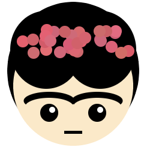

## Πρόσθεσε λεπτομέρειες

Το πρόσωπο ή η μάσκα σου χρειάζονται περισσότερες λεπτομέρειες για να το κάνουν πιο ενδιαφέρον; 

{:width="200px"}

--- task ---

Μπορείς να χρησιμοποιήσεις περισσότερα σχήματα για να προσθέσεις περισσότερα χαρακτηριστικά στο πρόσωπο ή τη μάσκα σου.

Πώς μπορείς να δώσεις στο πρόσωπο περισσότερη προσωπικότητα;

Θα μπορούσες να προσθέσεις:

+ Μια μύτη
+ Φρύδια
+ Αυτιά
+ Μάγουλα
+ Ανταύγειες / αντακλάσεις του φωτός
+ Ό, τι σου αρέσει!

Απλώς πρόσθεσε τις επιπλέον λεπτομέρειες που έχουν νόημα για το σχέδιό σου.

--- /task ---

--- task ---

Μπορείς να δημιουργήσεις μερικώς διαφανή χρώματα προσθέτοντας έναν τέταρτο αριθμό σε ένα χρώμα RGB για να του ορίσεις την **αδιαφάνεια**.

Αυτός ο κώδικας σχεδιάζει επικαλυπτόμενα φωτεινά σημεία στο παράδειγμα με τα φρούτα Kawaii:

--- code ---
---
language: python
filename: main.py - draw()
---

  #Ανταύγειες    
  fill(255, 255, 255, 70) #70 είναι η διαφάνεια/αδιαφάνεια εδώ    
  ellipse(170, 150, 35, 35)   
  ellipse(150, 160, 25, 25)

--- /code ---

--- /task ---

--- save ---
