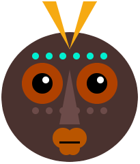

## Introduction

Write Python code to draw a face or mask using geometric shapes. 

The creation of **Geometric art** dates back to Ancient Greece where vases would be painted with patterns made up of shapes. Artists began using shapes to draw humans and animals with circles for heads, triangle bodies and lines for legs and arms.

You will:

+ Use code creatively to create a piece of digital art
+ Draw and position your art using geometric shapes and coordinates
+ Organise your code with functions
 

<mark>Updated theatre mask: https://trinket.io/library/trinkets/5c6927e202 - changes between happy/sad depending on mouse_x</mark>

--- no-print ---

### Get inspiration 

You are going to make some design decisions about the kind of face you will make and how you will use code to get the effect you want.

--- task ---

  

Look at these examples and think about how they have been made from circles, ellipses, squares, rectangles and triangles.

  <iframe src="https://trinket.io/embed/python/6bad88800b?outputOnly=true&start=result" width="600" height="500" frameborder="0" marginwidth="0" marginheight="0" allowfullscreen>
  </iframe>

  <iframe src="https://trinket.io/embed/python/f90794771c?outputOnly=true&start=result" width="600" height="500" frameborder="0" marginwidth="0" marginheight="0" allowfullscreen>
  </iframe>

  <iframe src="https://trinket.io/embed/python/b876d500ab?outputOnly=true&start=result" width="600" height="500" frameborder="0" marginwidth="0" marginheight="0" allowfullscreen>
  </iframe>

  

--- /task ---

--- /no-print ---

--- print-only ---

### Get inspiration 

You are going to make some design decisions about the kind of face you will make and how you will use code to get the effect you want.

See inside example projects in [Python 1: Make a face - Examples](https://trinket.io/library/folder/make-a-face-examples){:target="_blank"} Scratch studio.

--- /print-only ---

