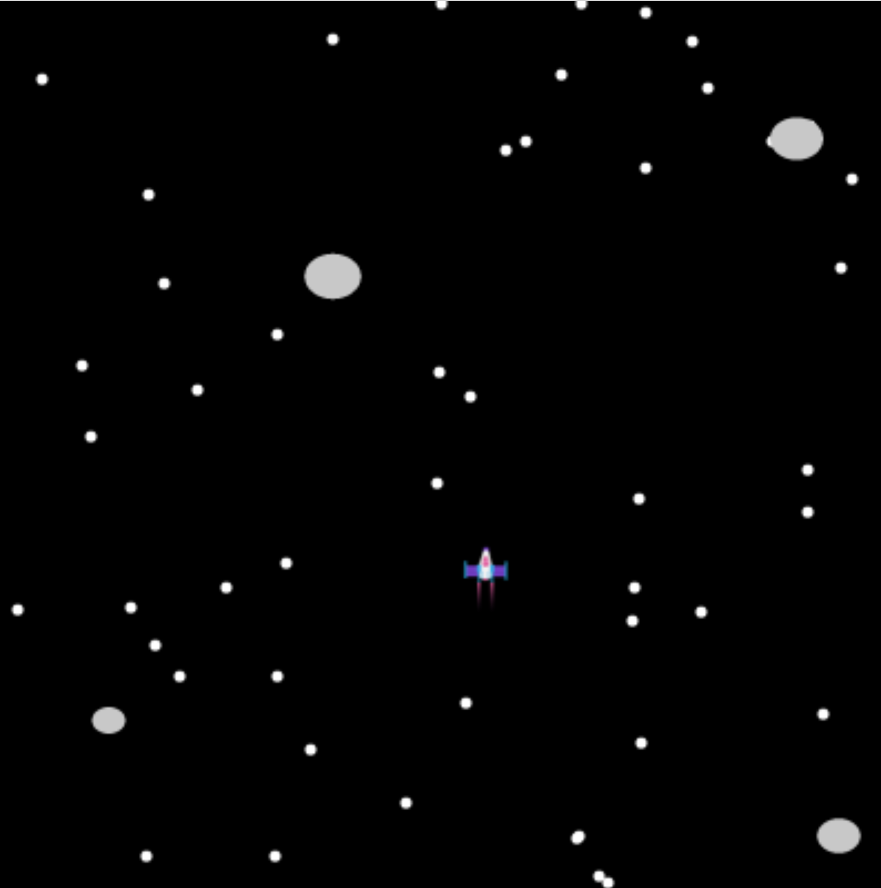

## What next?

If you are following the [Introduction to Python](https://projects.raspberrypi.org/en/raspberrypi/python-intro) pathway, you can move on to the [Don't collide](https://projects.raspberrypi.org/en/projects/dont-collide) project. In this project, you will make a scrolling obstacle game where your character has to reach a finishing point without colliding with obstacles.

--- print-only ---

--- /print-only ---

--- no-print ---

  <iframe allowtransparency="true" width="485" height="402" src="https://scratch.mit.edu/projects/embed/df07d4f46b/?autostart=false" frameborder="0"></iframe>

--- /no-print ---

If you want to have more fun exploring Python, then you could try out any of [these projects](https://projects.raspberrypi.org/en/projects?software%5B%5D=python).
