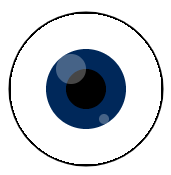

## Add eyes

Eyes make a shape start to look like a face.

{:width="200px"}

--- task ---

Think about what kind of eyes your face needs. The simplest eyes are just two circles. 

You could add different coloured irises and pupils. You could add light highlights / catchlights in a different colour. 

--- /task ---

Experiment with `ellipses` in the `draw` function to create the eyes you want. 

--- task ---

### Position the eyes

The first number in `ellipse` is the center of the eye. The eyes should be positioned the same distance from the centre of the drawing. 

In this example, `160` and `240` are both `40` pixels away from 200, which works for a drawing with a width of 400. 

--- code ---
---
language: python
filename: main.py - draw()
---
  fill(0, 0, 0) #Black — change to red, green, or blue up to 255
  eye_size = 50
  ellipse(160, 180, eye_size, eye_size) #x, y, width, height
  ellipse(240, 180, eye_size, eye_size)

--- /code --- 

**Tip:** If you want round eyes, then using an `eye_size` variable makes it easier to change the width and height of both eyes in one place.

[[[processing-python-ellipse]]]

--- collapse ---

---
title: Calculating positions based on width
---

The centre of a drawing is at position `width / 2` or half the width. You can use this to position the eyes by subtracting the eye width for the left eye and adding it for the right eye:

--- code ---
---
language: python
filename: main.py - draw()
---

  fill(0, 0, 0) #Black — change to red, green, or blue up to 255
  eye_size = 50
  ellipse( (width / 2) - 40, 180, eye_size, eye_size) #x, y, width, height
  ellipse( (width / 2) + 40 , 180, eye_size, eye_size)

--- /code ---

You could also calculate the width of the eyes based on width of the drawing.

--- code ---
---
language: python
filename: main.py - draw()
---

  fill(0, 0, 0) #Black — change to red, green, or blue up to 255
  ellipse( (width / 2) - (width / 10) , 180, eye_size, eye_size) #x, y, width, height
  ellipse( (width / 2) + (width / 10) , 180, eye_size, eye_size)

--- /code ---

--- /collapse ---

Change the second number in the `ellipse` function call to move the `y` (vertical) position of the eyes. 

--- /task ---

--- task ---

**Test:** Keep changing the shape and position of the eyes until you like the way they look.

**Tip:** If you set a stroke for drawing the face and don't want one for the eyes, then you will need to call `no_stroke()` before drawing the eyes. 

[[[processing-stroke]]]

--- /task ---

--- task ---

### Add detail

You can use more circles to create:
+ Coloured irises
+ Black pupils
+ White catchlights
+ Or, something else

This eye has a coloured iris, black pupil, and white catchlights with changed opacity:

[[[generic-theory-simple-colours]]]
[[[processing-opacity]]]

You can also animate the eyes by rotating them.

[[[processing-rotation]]]

--- /task ---

--- task ---

**Test:** Keep changing the eyes until you like the way they look.

Is your drawing starting to look like a face? 

--- /task ---

--- task ---

**Debug:** You might find some bugs in your project that you need to fix. Here are some common bugs.

--- collapse ---
---
title: The eyes aren't centred
---

You could use `height / 2` to place them in the centre.

--- /collapse ---

--- collapse ---
---
title: The eyes aren't aligned with each other
---

If you want the eyes to be aligned, then make sure you use the same number for coordinates for both eyes. Try using a variable so that the values are always the same. 

--- /collapse ---

--- collapse ---

---
title: I can't see the pupil or iris
---

The eye needs to be drawn first, then the iris, and finally the pupil. The order in which you draw things is very important.

Computer graphics are made of layers. In your eye, each ellipse is a layer. Objects on higher layers sit in front of objects on lower layers. Imagine cutting all the shapes out of paper. Depending on how you arrange and overlap that paper, the final result could look very different.

--- /collapse ---

--- collapse ---

---
title: My eyes are not round
---

The third and fourth numbers in `ellipse` are the width and height of the eyes. 

**Tip:** If you make them the same, you will get round eyes.

--- /collapse ---

--- /task ---

--- save ---
