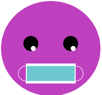

## Add a mouth

A mouth is a great way of showing emotion. Will your character have a smile, frown or something else? 

{:width="200px"}

--- task ---

Think about what kind of mouth your face needs. The simplest mouth would be a circle to look surprised. 

You could add two overlapping circles to create a smile or frown. Triangles or rectangles could be added for teeth. 

--- /task ---

--- task ---

Add code to your `draw()` function to add a mouth.

--- collapse ---

---
title: Create a mouth from overlapping circles
---

Set the `fill` colour for your mouth then draw a `ellipse`. Set the `fill` colour again, this time to match the face colour, then draw a second `ellipse`.

Change the `y-coordinate` of the second `ellipse` to a slightly higher position for a smile or a slightly lower position for a frown. 

--- code ---
---
language: python
filename: main.py - draw()
---

    fill(0, 0, 0) # a black mouth
    ellipse(200, 240, 15, 15)
    fill(255, 165, 0) # an orange face
    ellipse(200, 235, 15, 15) # higher circle

--- /code ---

--- code ---
---
language: python
filename: main.py - draw()
---

    fill(0, 0, 0) # a black mouth
    ellipse(200, 240, 15, 15)
    fill(255, 165, 0) # an orange face
    ellipse(200, 245, 15, 15) # lower circle

--- /code ---

--- /collapse ---

--- collapse ---

---
title: Create a mouth using rectangles
---

Robots are often shown with `rectangle` shaped mouths. Sometimes `rectangle` and `ellipse` shapes are used together to create a Grimace emoji or to add a face mask. 

Add the code for a `rectangle` then create a smaller `rectangle` within it. Change the `stroke` and `fill` colours to complement your theme. Add `ellipse` shapes if needed. 

**Tip:** remember to put the `ellipse` shapes above the `rectangle` code if you want them to go behind the `rectangle` shapes. 

--- code ---
---
language: python
filename: main.py - draw()
---
# Face mask
noFill() 
stroke(255, 255, 255) 
ellipse(150, 250, 30, 30) # left ear loop
ellipse(250, 250, 30, 30) # right ear loop
fill(255, 255, 255)
noStroke()
rect(150, 230, 100, 40) # large white recangle
fill(108, 200, 206)
rect(152, 235, 96, 30) # smaller blue rectangle

--- /code ---

--- /collapse ---

**Tip:** add a `# Mouth` comment on the line before your mouth code to help you easily find the mouth code.

--- /task ---

--- task ---

**Choose:** You could also add multiple teeth to your mouth using shapes that change their `x-coordinate`. 

--- collapse ---

---
title: Use a loop to add a row of teeth
---

Add code to create a `for` loop that repeats to create the number of teeth you need. 

Set a `gap` variable to `0` before the loop then change it within the loop to increase by itself `+` the number you want to move the teeth along by. 

Add the teeth shapes within the loop using the `gap` variable in the `x-coordinate`.

--- code ---
---
language: python
filename: main.py - draw()
---

# Mouth
  fill(90, 110, 184) 
  red = 90 # starting amount of red
  green = 110 # starting amount of green
  blue = 180 # starting amount of blue
  gap = 0 # starting amount of gap
  for i in range (0,6):  
    rect(100+gap, 300, 33, 50) # x-coordinate uses gap variable to move it each loop
    gap = gap+33 
    fill(red, green, blue) # uses variables to control colour change each loop
    red = red+40 
    blue = blue-30 

--- /code ---

--- /collapse ---

--- collapse ---

---
title: Use triangles to add fangs
---

Create a `rectangle` to use as the line of the mouth. A

Add two `triangle` shapes to create the fangs. Change the `x-coordinates` for each corner to position the fangs at opposite ends of the mouth line.

--- code ---
---
language: python
filename: main.py - draw()
---
# Mouth
  fill(0)
  rect(170, 260, 60, 5) # mouth line
  fill(0)
  triangle(170, 260, 180, 280, 190, 260) # left tooth
  triangle(210, 260, 220, 280, 230, 260) # right tooth
--- /code ---

--- /collapse ---

--- /task ---

--- save ---