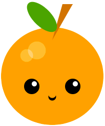

## What you will make

Escribe código Python para dibujar una cara o una máscara usando formas geométricas.

--- no-print ---

**Kawaii fruit**:
<iframe src="https://editor.raspberrypi.org/en/embed/viewer/fruit-face-example" width="400" height="710" frameborder="0" marginwidth="0" marginheight="0" allowfullscreen>
</iframe> **Máscara tribal**: \[Ver dentro\](https://trinket.io/python/f7def6e944){:target="_blank"}

**Stacked faces**:
<iframe src="https://editor.raspberrypi.org/en/embed/viewer/stacked-faces-example" width="400" height="710" frameborder="0" marginwidth="0" marginheight="0" allowfullscreen>
</iframe> Ver dentro de los proyectos de ejemplo en el estudio Scratch [Python 1: Haz una cara- Ejemplos](https://trinket.io/library/folder/make-a-face-examples){:target="_blank"}.

**Tribal mask**:
<iframe src="https://editor.raspberrypi.org/en/embed/viewer/tribal-mask-example" width="400" height="710" frameborder="0" marginwidth="0" marginheight="0" allowfullscreen>
</iframe> **Caras apiladas**: \[Ver dentro\](https://trinket.io/python/95faa8208c){:target="_blank"}

--- /no-print ---

--- print-only ---

  

--- /print-only ---

