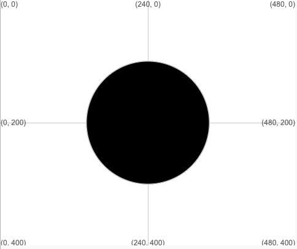

## Forma de la cara

Dibuja y colorea una forma para tu cara o máscara. No agregues las otras características todavía, vendrán más tarde.

{:width="200px"}

--- task ---

Decide la forma principal de la cara para tu máscara. Puede ser un círculo, una elipse, un rectángulo o incluso un triángulo.

Agrega código a la función `draw()` para dibujar una cara o una máscara.

Este ejemplo dibuja un círculo en el medio, pero depende de ti qué forma usar.

--- code ---
---
language: python filename: main.py - draw() line_numbers: true line_number_start: 10
line_highlights: 14, 15
---

def draw(): # Put code to run every frame here background(255, 255, 255)  # Change to your background colour

    # Add code to draw your face here
    ellipse(width/2, height/2, 200, 200)  # Circle in the middle
    
    grid()  # add a # to the beginning of this line to hide the grid

--- /code ---

[[[processing-python-ellipse]]]

[[[processing-python-rect]]]

[[[processing-python-triangle]]]

--- /task ---

--- task ---

**Prueba:** Ejecuta tu código y cámbialo para obtener el tamaño y la forma de la cara que deseas.

--- /task ---

--- task ---

Elige un color de trazo para el contorno y un color de relleno para la parte principal de la forma.

[[[processing-stroke]]]

Si no deseas un contorno utiliza `sin_contorno()`.

--- code ---
---
language: python filename: main.py - draw() line_numbers: true line_number_start: 13
line_highlights: 14
---

    def draw(): 
      stroke(0) #También puedes usar no_stroke() 
      fill(255, 255, 0) #Amarillo brillante 
      ellipse(width/2, height/2, 200, 200) #Círculo en medio

--- /code ---

[[[generic-theory-simple-colours]]]

--- /task ---

--- task ---

**Prueba:** Ejecuta tu código y cambia el color hasta que encuentres el que más te guste.

--- /task ---

--- save ---
