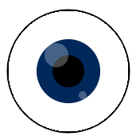

## Agrega los ojos

Los ojos hacen que una forma comience a parecerse a una cara.

{:width="200px"}

--- task ---

Piensa en qué tipo de ojos necesita tu rostro. Los ojos más simples son sólo dos círculos.

Puedes agregar iris y pupilas de diferentes colores. Puedes agregar reflejos de luz o destellos de un color diferente.

--- /task ---

Experimenta con `elipses` en la función `draw` para crear los ojos que deseas.

--- task ---

### Posiciona las ojos

El primer número en `ellipse` es el centro del ojo. Los ojos deben colocarse a la misma distancia del centro del dibujo.

En este ejemplo, `160` y `240` están a `40` píxeles de 200, lo que está bien para un dibujo con un ancho de 400.

--- code ---
---
language: python
filename: main.py - draw()
---
  fill(0, 0, 0) #Negro: cambia a rojo, verde o azul hasta 255
  tamano_de_ojos = 50
  ellipse(160, 180, tamano_de_ojos, tamano_de_ojos) #x, y, ancho, alto
  ellipse(240, 180, tamano_de_ojos, tamano_de_ojos)

--- /code --- 

**Sugerencia:** Si deseas ojos redondos, usar una variable `tamano_de_ojos` hará que sea más fácil cambiar el ancho y la altura de ambos ojos en un solo lugar.

[[[processing-python-ellipse]]]

--- collapse ---

---
title: Calculando posiciones basadas en el ancho
---

El centro de un dibujo está en la posición `width / 2` o la mitad del ancho. Puedes usar esto para posicionar los ojos restando el ancho del ojo izquierdo y sumándolo para el ojo derecho:

--- code ---
---
language: python
filename: main.py - draw()
---

  fill(0, 0, 0) #Negro: cambia a rojo, verde o azul hasta 255 
  tamano_de_ojos = 50 
  ellipse( (width / 2) - 40, 180, tamano_de_ojos, tamano_de_ojos) #x, y, ancho, alto 
  ellipse( (width / 2) + 40 , 180, tamano_de_ojos, tamano_de_ojos)

--- /code ---

También podrías calcular el ancho de los ojos en función del ancho del dibujo.

--- code ---
---
language: python
filename: main.py - draw()
---

  fill(0, 0, 0) #Negro: cambia a rojo, verde o azul hasta 255 
  ellipse( (width / 2) - (width / 10) , 180, tamano_de_ojos, tamano_de_ojos) #x, y, ancho, alto 
  ellipse( (width / 2) + (width / 10) , 180, tamano_de_ojos, tamano_de_ojos)

--- /code ---

--- /collapse ---

Cambia el segundo número en la llamada de función `ellipse` para mover la posición `y` (vertical) de los ojos.

--- /task ---

--- task ---

**Prueba:** Sigue cambiando la forma y la posición de los ojos hasta que te guste cómo se ven.

**Sugerencia:** Si estableces un trazo para dibujar la cara y no quieres usar uno para los ojos, deberás llamar a `no_stroke()` antes de dibujar los ojos.

[[[processing-stroke]]]

--- /task ---

--- task ---

### Agrega detalles

Puedes usar más círculos para crear:
+ Iris de colores
+ Pupilas negras
+ Destellos blancos
+ O algo más

Este ojo tiene un iris coloreado, pupila negra y destellos blancos con opacidad modificada: 

[[[generic-theory-simple-colours]]] [[[processing-opacity]]]

También puedes animar los ojos haciéndolos rotar.

[[[processing-rotation]]]

--- /task ---

--- task ---

**Prueba:** Sigue cambiando los ojos hasta que te guste cómo se ven.

¿Tu dibujo empieza a parecerse a una cara?

--- /task ---

--- task ---

**Depurar:** Es posible que encuentres algunos errores en tu proyecto que necesites corregir. A continuación, se muestran algunos errores comunes.

--- collapse ---
---
title: Los ojos no están centrados
---

Puedes usar `height / 2` para colocarlos en el centro.

--- /collapse ---

--- collapse ---
---
title: Los ojos no están alineados entre sí
---

Si quieres que los ojos estén alineados, entonces asegúrate de usar el mismo número para las coordenadas en ambos ojos. Intenta usar una variable para que los valores siempre sean los mismos.

--- /collapse ---

--- collapse ---

---
title: No puedo ver la pupila o el iris
---

Primero hay que dibujar el ojo, luego el iris y por último la pupila. El orden en que dibujas las cosas es muy importante.

Los gráficos por computadora están hechos de capas. En tu ojo cada elipse es una capa. Los objetos de las capas superiores se ubican delante de los objetos de las capas inferiores. Imagina cortar todas las formas en papel. Dependiendo de cómo organices y superpongas ese papel, el resultado final podría verse muy diferente.

--- /collapse ---

--- collapse ---

---
title: Mis ojos no son redondos
---

El tercer y cuarto número en `ellipse` son el ancho y la altura de los ojos.

**Tip:** Si usas los mismos números obtendrás ojos redondos.

--- /collapse ---

--- /task ---

--- save ---
