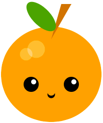

## What you will make

Écrire du code Python pour dessiner un visage ou un masque à l'aide de formes géométriques.

--- no-print ---

**Fruits Kawaii** :
<iframe src="https://editor.raspberrypi.org/en/embed/viewer/fruit-face-example" width="400" height="710" frameborder="0" marginwidth="0" marginheight="0" allowfullscreen>
</iframe> [voir à l'intérieur](https://editor.raspberrypi.org/en/projects/fruit-face-example){:target="_blank"}

**Visages empilés** :
<iframe src="https://editor.raspberrypi.org/en/embed/viewer/stacked-faces-example" width="400" height="710" frameborder="0" marginwidth="0" marginheight="0" allowfullscreen>
</iframe> [voir à l'intérieur](https://editor.raspberrypi.org/en/projects/stacked-faces-example){:target="_blank"}

**Masque tribal** :
<iframe src="https://editor.raspberrypi.org/en/embed/viewer/tribal-mask-example" width="400" height="710" frameborder="0" marginwidth="0" marginheight="0" allowfullscreen>
</iframe> [voir à l'intérieur](https://editor.raspberrypi.org/en/projects/tribal-mask-example){:target="_blank"}

--- /no-print ---

--- print-only ---

  

--- /print-only ---

