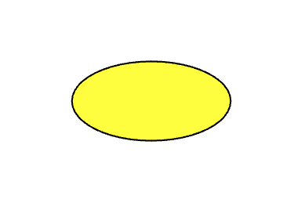

## Cercles et ovales

Dessine et colorie une forme pour ton visage ou ton masque.

Une **ellipse** est une forme ovale. Si tu spécifies la même largeur et la même hauteur, tu dessineras un cercle.

--- task ---

Ajoute du code à la fonction `draw()` pour définir la couleur de remplissage en utilisant les valeurs rouge, verte et bleue, comme tu l'as fait pour l'arrière-plan.

Ensuite, dessine un cercle dans cette couleur.

--- code ---
---
language: python
line_numbers: true
line_number_start: 12
line_highlights: 16-22
---

def draw():
    # Mettre le code pour exécuter chaque image ici
    background(255, 255, 255)  
    # Ajoute du code pour dessiner ton visage ici
    fill(255, 255, 0) 
    ellipse(
        taille_ecran/2, 
        taille_ecran/2, 
        200, 
        200
    )  
  
--- /code ---

--- /task ---

--- task ---

**Test :** exécute ton code et tu devrais voir un cercle coloré.

--- /task ---

--- task ---

Modifie les valeurs de largeur et de hauteur pour voir l'ellipse changer de forme.

--- code ---
---
language: python
line_numbers: true
line_number_start: 10
line_highlights: 18-19
---

def draw():
    # Mettre le code pour exécuter chaque image ici
    background(255, 255, 255)  
    # Ajoute du code pour dessiner ton visage ici
    fill(255, 255, 0) 
    ellipse(
        taille_ecran/2, 
        taille_ecran/2, 
        100, # largeur
        50   # hauteur
    )  
  
--- /code ---

--- /task ---

--- task ---

Avant le code où tu dessines l'ellipse, tu peux choisir de définir une couleur et une épaisseur.

--- code ---
---
language: python
line_numbers: true
line_number_start: 14
line_highlights: 15-16
---
    fill(255, 255, 0) 
    stroke(255, 255, 255)  
    stroke_weight(3)
    ellipse(
        taille_ecran/2, 
        taille_ecran/2, 
        100, 
        50
    )  
    
--- /code ---

Ou, si tu préfères, tu peux supprimer le trait et ne pas avoir de contour.

--- code ---
---
language: python
line_numbers: true
line_number_start: 14
line_highlights: 15
---
    fill(255, 255, 0) 
    no_stroke()
    ellipse(
        taille_ecran/2, 
        taille_ecran/2, 
        100, 
        50
    )  
  
--- /code ---

--- /task ---

--- task ---

**Test :** expérimente en modifiant la couleur et l'épaisseur du trait ou en le supprimant, puis exécute ton code pour voir les résultats.

--- /task ---