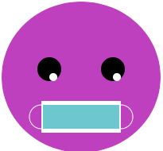

## Ajouter une bouche

Une bouche est un excellent moyen de montrer une émotion. Ton personnage aura-t-il un sourire, un froncement de sourcils ou autre chose ? 

{:width="200px"}

--- task ---

Pense au type de bouche dont ton visage a besoin. La bouche la plus simple serait un cercle pour avoir l'air surpris.

Tu peux ajouter deux cercles qui se chevauchent pour créer un sourire ou un froncement de sourcils. Des triangles ou des rectangles pourraient être ajoutés pour les dents.

--- /task ---

--- task ---

Ajoute du code à ta fonction `dessin()` pour ajouter une bouche.

--- collapse ---

---
title: Créer une bouche à partir de cercles superposés
---

Définis la couleur de `remplissage` pour ta bouche puis dessine une `ellipse`. Définis à nouveau la couleur de `remplissage`, cette fois pour qu'elle corresponde à la couleur du visage, puis dessine une seconde `ellipse`.

Change la coordonnée `y` de la seconde `ellipse` en une position légèrement plus haute pour un sourire ou une position légèrement plus basse pour un froncement de sourcils.

--- code ---
---
language: python
filename: main.py - draw()
---

    fill(0, 0, 0) #Une bouche noire
    ellipse(200, 240, 15, 15)
    fill(255, 165, 0) #Un visage orange
    ellipse(200, 235, 15, 15) #Cercle supérieur

--- /code ---

--- code ---
---
language: python
filename: main.py - draw()
---

    fill(0, 0, 0) #Une bouche noire
    ellipse(200, 240, 15, 15)
    fill(255, 165, 0) #Un visage orange
    ellipse(200, 245, 15, 15) #Cercle intérieur

--- /code ---

--- /collapse ---

--- collapse ---

---
title: Créer une bouche à l'aide de rectangles
---

Les robots sont souvent représentés avec des bouches en forme de `rectangle`. Parfois, les formes `rectangle` et `ellipse` sont utilisées ensemble pour créer un emoji grimace ou pour ajouter un masque.

Ajoute le code d'un `rectangle`, puis crée un `rectangle` plus petit à l'intérieur. Modifie les couleurs de `traits` et de `remplissage` pour compléter ton thème. Ajoute des formes d'`ellipse` si nécessaire.

**Astuce :** N'oublie pas de placer les formes d'`ellipse` au-dessus du code `rectangle` si tu veux qu'elles aillent derrière les formes `rectangle`.

--- code ---
---
language: python
filename: main.py - draw()
---

    no_fill() 
    stroke(255, 255, 255) 
    ellipse(150, 250, 30, 30) #Boucle d'oreille gauche 
    ellipse(250, 250, 30, 30) #Boucle d'oreille droite 
    fill(255, 255, 255) 
    no_stroke() 
    rect(150, 230, 100, 40) #Grand rectangle blanc 
    fill(108, 200, 206) 
    rect(152, 235, 96, 30) #Petit rectangle bleu

--- /code ---

--- /collapse ---

**Astuce :** ajoute un commentaire `#Bouche` sur la ligne avant ton code pour la bouche pour t'aider à trouver facilement son code.

--- /task ---

--- task ---

**Choisir :** tu peux également ajouter plusieurs dents à ta bouche en utilisant `translate` pour modifier la coordonnée `x` après avoir dessiné chaque dent.

--- collapse ---

---
title: Utiliser une boucle pour ajouter une rangée de dents
---

Ajoute du code pour créer une boucle `for` qui se répète afin de créer le nombre de dents dont tu as besoin.

Une fois chaque dent dessinée, ajoute du code pour le `translate()` de la largeur de la dent.

Tu peux également ajouter du code pour changer la couleur de chaque dent.

--- code ---
---
language: python
filename: main.py - draw()
---

    fill(90, 110, 184) 
      rouge = 90 #Quantité de départ de rouge 
      vert = 110 #Quantité de départ de vert 
      bleu = 180 #Quantité de départ de bleu 
      for i in range (0,6): 
        rect(100, 300, 33, 50) 
        fill(rouge, vert, bleu) #Utilise des variables pour contrôler le changement de couleur à chaque boucle 
        rouge = rouge+40 
        bleu = bleu-30 
        translate(33, 0) #Se déplacer le long de la coordonnée x de la largeur d'une dent

--- /code ---

--- /collapse ---

[[[processing-translation]]]

--- collapse ---

---
title: Utilise des triangles pour ajouter des canines
---

Crée un `rectangle` à utiliser comme ligne de la bouche.

Ajoute deux formes de `triangle` pour créer les canines. Modifie les coordonnées `x` pour chaque coin afin de positionner les canines aux extrémités opposées de la ligne de la bouche.

--- code ---
---
language: python
filename: main.py - draw()
---

    fill(0) 
      rect(170, 260, 60, 5) #Ligne de bouche 
      fill(0) 
      triangle(170, 260, 180, 280, 190, 260) #Dent gauche 
      triangle(210, 260, 220, 280, 230, 260) #Dent droite 
    --- /code ---
--- /code ---

--- /collapse ---

--- /task ---

--- task ---

**Débogage :** il est possible que tu trouves des bogues dans ton projet que tu dois corriger. Voici quelques bogues assez courants.

--- collapse ---

---
title: Ma forme superposée sort du visage
---

Si tu utilises deux formes qui se chevauchent pour créer une bouche, tu dois t'assurer que la forme de la même couleur que le visage ne dépasse pas le visage. Si c'est le cas, modifie la largeur ou la hauteur de la forme afin qu'elle soit suffisamment petite pour tenir à l'intérieur du visage.

--- /collapse ---

--- collapse ---

---
title: J'ai trop de dents
---

N'oublie pas que `range()` crée une séquence de nombres commençant par 0 et non 1. Cela peut faire une différence dans ton code en fonction de la façon dont tu as positionné tes dents.

--- /collapse ---

--- /task ---

--- save ---
