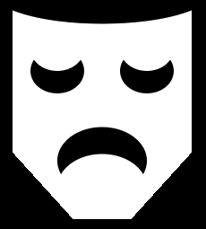

## Formes superposées

Une bouche est un excellent moyen de montrer une émotion. Ton personnage aura-t-il un sourire, un froncement de sourcils ou autre chose ? 

{:width="200px"}

Tu peux créer des formes que tu ne pourrais pas créer autrement en superposant des formes, par exemple, tu peux ajouter deux cercles superposés pour créer un sourire.

--- task ---

Commence par une ellipse pour représenter le visage.

--- code ---
---
language: python line_numbers: true line_number_start: 12
line_highlights: 17-18
---
def draw(): # Put code to run every frame here background(255, 255, 255) # Add code to draw your face here no_stroke() fill(125, 75, 0) # Brown ellipse(200, 220, 150, 150) # Face

--- /code ---

--- /task ---

--- task ---

Définis la couleur de `remplissage` pour ta bouche puis dessine une `ellipse`.

--- code ---
---
language: python line_numbers: true line_number_start: 12
line_highlights: 19-22
---
def draw(): # Put code to run every frame here background(255, 255, 255) # Add code to draw your face here no_stroke() fill(125, 75, 0) # Brown ellipse(200, 220, 150, 150) # Face fill(255, 0, 0)  # Red ellipse(200, 240, 40, 40) # Mouth

--- /code ---

--- /task ---

--- task ---

Définis la couleur de `remplissage` pour qu'elle corresponde à la couleur du visage, puis dessine une deuxième `ellipse`.

Modifie la coordonnée `y` de la deuxième ellipse `` à une position légèrement plus haute pour un sourire.

--- code ---
---
language: python line_numbers: true line_number_start: 18
line_highlights: 20-21
---

    fill(255, 0, 0)  # Red
    ellipse(200, 240, 40, 40) # Mouth
    fill(125, 75, 0) # Brown
    ellipse(200, 235, 40, 40) # Overlap

--- /code ---

--- /task ---

--- task ---

**Test :** expérimente en modifiant les couleurs de remplissage et les tailles des ellipses. Exécute ton programme pour voir les résultats.

--- /task ---