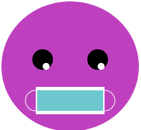

## Add a mouth

A mouth is a great way of showing emotion. Will your character have a smile, frown, or something else? 

{:width="200px"}

--- task ---

Think about what kind of mouth your face needs. The simplest mouth would be a circle to look surprised.

You could add two overlapping circles to create a smile or frown. Triangles or rectangles could be added for teeth.

--- /task ---

--- task ---

Add code to your `draw()` function to add a mouth.

--- collapse ---

---
title: Create a mouth from overlapping circles
---

Set the `fill` colour for your mouth then draw an `ellipse`. Set the `fill` colour again, this time to match the face colour, then draw a second `ellipse`.

Change the `y` coordinate of the second `ellipse` to a slightly higher position for a smile or a slightly lower position for a frown.

--- code ---
---
language: python
filename: main.py - draw()
---

    fill(0, 0, 0) #A black mouth
    ellipse(200, 240, 15, 15)
    fill(255, 165, 0) #An orange face
    ellipse(200, 235, 15, 15) #Higher circle

--- /code ---

--- code ---
---
language: python
filename: main.py - draw()
---

    fill(0, 0, 0) #A black mouth
    ellipse(200, 240, 15, 15)
    fill(255, 165, 0) #An orange face
    ellipse(200, 245, 15, 15) #Lower circle

--- /code ---

--- /collapse ---

--- collapse ---

---
title: Create a mouth using rectangles
---

Robots are often shown with `rectangle` shaped mouths. Sometimes `rectangle` and `ellipse` shapes are used together to create a grimace emoji or to add a face mask.

Add the code for a `rectangle`, then create a smaller `rectangle` within it. Change the `stroke` and `fill` colours to complement your theme. Add `ellipse` shapes if needed.

**Tip:** Remember to put the `ellipse` shapes above the `rectangle` code if you want them to go behind the `rectangle` shapes.

--- code ---
---
language: python
filename: main.py - draw()
---
# Face mask
no_fill()    
stroke(255, 255, 255)     
ellipse(150, 250, 30, 30) #Left ear loop    
ellipse(250, 250, 30, 30) #Right ear loop    
fill(255, 255, 255)    
no_stroke()     
rect(150, 230, 100, 40) #Large white rectangle    
fill(108, 200, 206)    
rect(152, 235, 96, 30) #Smaller blue rectangle

--- /code ---

--- /collapse ---

**Tip:** Add a `#Mouth` comment on the line before your mouth code to help you easily find the mouth code.

--- /task ---

--- task ---

**Choose:** You could also add multiple teeth to your mouth using `translate` to change the `x` coordinate after each tooth is drawn.

--- collapse ---

---
title: Use a loop to add a row of teeth
---

Add code to create a `for` loop that repeats in order to create the number of teeth you need.

After each tooth has been drawn, add code to `translate()` it by the width of the tooth.

You can also add code to change the colour of each tooth.

--- code ---
---
language: python
filename: main.py - draw()
---

# Mouth
fill(90, 110, 184)     
red = 90 #Starting amount of red   
green = 110 #Starting amount of green    
blue = 180 #Starting amount of blue    
for i in range (0,6):     
rect(100, 300, 33, 50)     
fill(red, green, blue) #Uses variables to control the colour change each loop    
red = red+40     
blue = blue-30     
translate(33, 0) #Move along the x coordinate by the width of a tooth

--- /code ---

--- /collapse ---

[[[processing-translation]]]

--- collapse ---

---
title: Use triangles to add fangs
---

Create a `rectangle` to use as the line of the mouth.

Add two `triangle` shapes to create the fangs. Change the `x` coordinates for each corner to position the fangs at opposite ends of the mouth line.

--- code ---
---
language: python
filename: main.py - draw()
---
# Mouth
  fill(0)    
rect(170, 260, 60, 5) #Mouth line    
fill(0)    
triangle(170, 260, 180, 280, 190, 260) #Left tooth    
triangle(210, 260, 220, 280, 230, 260) #Right tooth    
--- /code ---

--- /collapse ---

--- /task ---

--- task ---

**डीबग:** आपको अपने प्रोजेक्ट में कुछ बग मिल सकते हैं जिन्हें आपको ठीक करने की आवश्यकता है। Here are some common bugs.

--- collapse ---

---
title: My overlapping shape goes outside the face
---

If you use two overlapping shapes to create a mouth, then you need to make sure the shape that is the same colour as the face doesn't go outside the face. If it does, then change the width or height of the shape so that it's small enough to fit inside the face.

--- /collapse ---

--- collapse ---

---
title: I have too many teeth
---

Don't forget that `range()` creates a sequence of numbers starting from 0 not 1. This may make a difference to your code depending on how you have positioned your teeth.

--- /collapse ---

--- /task ---

--- save ---
