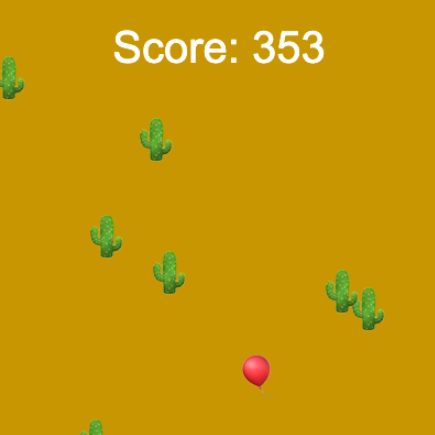

## E adesso?

Se stai seguendo il percorso [Introduzione a Python](https://projects.raspberrypi.org/it-IT/raspberrypi/python-intro), puoi passare al progetto [Non scontrarti!](https://projects.raspberrypi.org/it-IT/projects/dont-collide). In questo progetto realizzerai un gioco di corsa ad ostacoli in cui il tuo personaggio deve raggiungere un punto finale senza scontrarsi con gli ostacoli.

--- print-only ---

--- /print-only ---

--- no-print ---

<iframe src="https://editor.raspberrypi.org/it-IT/embed/viewer/dont-pop-example" width="600" height="600" frameborder="0" marginwidth="0" marginheight="0" allowfullscreen>
</iframe>

--- /no-print ---

Se vuoi divertirti di più esplorando Python, puoi provare uno qualsiasi di [questi progetti](https://projects.raspberrypi.org/it-IT/projects?software%5B%5D=python).

***

Questo progetto è stato tradotto da volontari:

Omar Lazzari
Claudio Santancini
Stefano Panzera
Ivan Baldassin

Grazie ai volontari, possiamo offrire alle persone di tutto il mondo la possibilità di imparare nella loro lingua. Puoi aiutarci a raggiungere più persone offrendoti come volontario per la traduzione - puoi trovare maggiori informazioni su [rpf.io/translate](https://rpf.io/translate).
