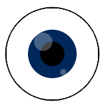

## Aggiungi gli occhi

Gli occhi fanno subito sembrare qualunque forma una faccia.

{:width="200px"}

--- task ---

Pensa a quale tipo di occhi ha bisogno il tuo viso. Gli occhi più semplici sono due cerchi.

Potresti aggiungere iridi e pupille di colori diversi. Puoi anche aggiungere riflessi / luccichii di un altro colore.

--- /task ---

Sperimenta con il comando  `ellipses` nella funzione `draw` per creare gli occhi che desideri.

--- task ---

### Posiziona gli occhi

Il primo numero in `ellipse` indica il centro dell'occhio. Gli occhi dovrebbero essere posizionati alla stessa distanza dal centro del disegno.

In questo esempio, `160` e `240` sono entrambi a `40` pixel di distanza da 200, che è il centro preciso di un disegno largo 400 pixel.

--- code ---
---
language: python
filename: main.py - draw()
---
    fill(0, 0, 0)  # Nero - cambia in rosso, verde o blu fino a 255
    eye_size = 50
    ellipse(160, 180, eye_size, eye_size)  # x, y, larghezza, altezza
    ellipse(240, 180, eye_size, eye_size)

--- /code --- 

**Suggerimento:** Se vuoi occhi rotondi, usare una variabile `eye_size` rende più veloce cambiare larghezza e altezza di entrambi gli occhi in un colpo solo.

[[[processing-python-ellipse]]]

--- collapse ---

---
title: Calcolo delle posizioni in base alla larghezza
---

Il centro di un disegno è in posizione `width / 2` o metà della larghezza. Puoi usare questo valore per posizionare gli occhi sottraendo la larghezza dell'occhio per l'occhio sinistro e aggiungendolo per l'occhio destro:

--- code ---
---
language: python
filename: main.py - draw()
---

    fill(0, 0, 0)  # Nero - cambia in rosso, verde o blu fino a 255
    eye_size = 50
    ellipse( (width / 2) - 40, 180, eye_size, eye_size)  # x, y, larghezza, altezza
    ellipse( (width / 2) + 40 , 180, eye_size, eye_size)

--- /code ---

Potresti anche calcolare la larghezza degli occhi in base alla larghezza del disegno.

--- code ---
---
language: python
filename: main.py - draw()
---

    fill(0, 0, 0)  # Nero - cambia in rosso, verde o blu fino a 255
    ellipse( (width / 2) - (width / 10) , 180, eye_size, eye_size)  # x, y, larghezza, altezza
    ellipse( (width / 2) + (width / 10) , 180, eye_size, eye_size)

--- /code ---

--- /collapse ---

Cambia il secondo numero nella chiamata della funzione `ellipse` per spostare la posizione `y` (verticale) degli occhi.

--- /task ---

--- task ---

**Test:** Continua a cambiare la forma e la posizione degli occhi fino a quando non ti piace il loro aspetto.

**Suggerimento:** Se imposti un bordo per il viso ma non lo vuoi per gli occhi, dovrai inserire il comando `no_stroke()` prima di disegnare gli occhi.

[[[processing-stroke]]]

--- /task ---

--- task ---

### Aggiungi i dettagli

Puoi usare più cerchi per creare:
+ Iridi colorate
+ Pupille nere
+ Riflessi bianchi
+ O qualcos'altro

Questo occhio ha un'iride colorata, pupilla nera e luci riflesse con opacità modificata:

[[[generic-theory-simple-colours]]]
[[[processing-opacity]]]

Puoi anche animare gli occhi facendoli ruotare.

[[[processing-rotation]]]

--- /task ---

--- task ---

**Test:** Continua a cambiare gli occhi finché non ti soddisfa il risultato.

Il tuo disegno sta iniziando ad assomigliare a una faccia?

--- /task ---

--- task ---

**Debug:** Potresti trovare alcuni bug da correggere nel tuo progetto. Ecco alcuni bug tra i più comuni.

--- collapse ---
---
title: Gli occhi non sono centrati
---

Potresti usare `height / 2` per posizionarli al centro.

--- /collapse ---

--- collapse ---
---
title: Gli occhi non sono allineati tra di loro
---

Se vuoi che gli occhi siano allineati, assicurati di usare lo stesso numero per le coordinate di entrambi gli occhi. Prova a usare una variabile in modo che i valori siano sempre gli stessi.

--- /collapse ---

--- collapse ---

---
title: Non riesco a vedere la pupilla o l'iride
---

L'occhio deve essere disegnato per primo, poi l'iride e infine la pupilla. L'ordine in cui disegni le cose è fondamentale.

La computer grafica è realizzata a livelli. Nei tuoi occhi, ogni ellisse è un livello. Gli oggetti su livelli superiori coprono gli oggetti presenti ai livelli inferiori. Immagina di tagliare tante forme di carta. A seconda di come si organizzano e si sovrappongono i pezzi, il risultato finale sarà molto diverso.

--- /collapse ---

--- collapse ---

---
title: I miei occhi non sono rotondi
---

Il terzo e il quarto numero in `ellipse` sono la larghezza e l'altezza degli occhi.

**Suggerimento:** Se usi lo stesso valore, otterrai occhi rotondi.

--- /collapse ---

--- /task ---

--- save ---
