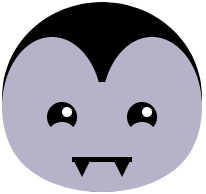

## 口を追加

口は感情を表すのに最適な方法です。 あなたのキャラクターは笑顔、眉をひそめている、または何か他のものを持っていますか？ 

{:width="200px"}

--- task ---

あなたの顔がどんな口を必要としているか考えてください。 最も単純な口は、驚いたように見える円です。

2つの重なり合う円を追加して、笑顔や眉をひそめることができます。 三角形または長方形を歯に追加できます。

--- /task ---

--- task ---

`draw()`関数にコードを追加して、口を追加します。

--- collapse ---

---
タイトル：重なり合う円から口を作成します
---

口に `塗りつぶし` 色を設定してから、 `の楕円`を描画します。 今度は顔の色と一致するように、 `塗りつぶし` の色を再度設定してから、2番目の `の楕円`を描画します。

2番目の `ellipse`の`y`座標を、笑顔の場合は少し高い位置に、眉をひそめている場合は少し低い位置に変更します。

--- code ---
---
language: python
filename: main.py - draw()
---

    fill(0, 0, 0) #黒い口
    ellipse(200, 240, 15, 15)
    fill(255, 165, 0) #オレンジ色の顔
    ellipse(200, 235, 15, 15) #上の円

--- /code ---

--- code ---
---
language: python
filename: main.py - draw()
---

    fill(0, 0, 0) #黒い口
    ellipse(200, 240, 15, 15)
    fill(255, 165, 0) #オレンジ色の顔
    ellipse(200, 245, 15, 15) #下の円

--- /code ---

--- /collapse ---

--- collapse ---

---
title: 長方形を使用して口を作成します
---

ロボットは、多くの場合、 個の`長方形の` 個の形をした口で示されます。 `長方形` と `楕円` の形状を一緒に使用して、しかめっ面の絵文字を作成したり、フェイスマスクを追加したりすることがあります。

`長方形`のコードを追加し、その中に小さい `長方形` を作成します。 テーマを補完するために、 `ストローク` と `塗りつぶし` 色を変更します。 必要に応じて、 `楕円` 個の形状を追加します。

**ヒント：** `長方形` の図形の後ろに配置する場合は、 `楕円` の図形を `長方形` のコードの上に配置することを忘れないでください。

--- code ---
---
language: python
filename: main.py - draw()
---
#マスク
no_fill()    
stroke(255, 255, 255)     
ellipse(150, 250, 30, 30) #左耳ループ    
ellipse(250, 250, 30, 30) #右耳ループ    
fill(255, 255, 255)    
no_stroke()     
rect(150, 230, 100, 40) #大きな白い長方形    
fill(108, 200, 206)    
rect(152, 235, 96, 30) #小さい青い長方形

--- /code ---

--- /collapse ---

**ヒント：** 口コードを簡単に見つけられるように、口コードの前の行に `#口` コメントを追加します。

--- /task ---

--- task ---

**選択：** `translate` を使用して複数の歯を口に追加し、各歯が描かれた後に `x`座標を変更することもできます。

--- collapse ---

---
title: ループを使用して歯の列を追加します
---

必要な数の歯を作成するために繰り返す `ループを作成する` を追加します。

各歯が描かれた後、歯の幅だけ `translate()` にコードを追加します。

各歯の色を変更するコードを追加することもできます。

--- code ---
---
language: python
filename: main.py - draw()
---

#口
fill(90, 110, 184)     
  red = 90 #赤の開始量   
  green = 110 #緑の開始量    
  blue = 180 #青の開始量    
  for i in range (0,6):     
    rect(100, 300, 33, 50)     
    fill(red, green, blue) #変数を使用して、各ループの色の変更を制御します    
    red = red+40     
    blue = blue-30     
    translate(33, 0) #歯の幅だけx座標に沿って移動します

--- /code ---

--- /collapse ---

[[[processing-translation]]]

--- collapse ---

---
title: 三角形を使用して牙を追加します
---

口の線として使用する `の長方形` を作成します。

2つの `三角形` の形状を追加して、牙を作成します。 各コーナーの `x`座標を変更して、牙をマウスラインの両端に配置します。

--- code ---
---
language: python
filename: main.py - draw()
---
#口
  fill(0)    
  rect(170, 260, 60, 5) #口のライン    
  fill(0)    
  triangle(170, 260, 180, 280, 190, 260) #左歯    
  triangle(210, 260, 220, 280, 230, 260) #右歯    
--- /code ---

--- /collapse ---

--- /task ---

--- task ---

**デバッグ：** プロジェクトに修正が必要なバグが見つかる場合があります。 一般的なバグは次のとおりです。

--- collapse ---

---
title: 重なり合った形が顔の外に出ます
---

2つの重なり合う形状を使用して口を作成する場合は、顔と同じ色の形状が顔の外側に出ないようにする必要があります。 その場合は、形状の幅または高さを変更して、顔の内側に収まるように小さくします。

--- /collapse ---

--- collapse ---

---
title: 歯が多すぎる
---

`range()`は、1ではなく0から始まる数列を作成することを忘れないでください。 これは、歯の配置方法によっては、コードに違いをもたらす可能性があります。

--- /collapse ---

--- /task ---

--- save ---
