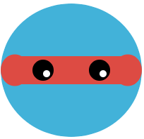

## Voeg ogen toe

Ogen laten een vorm eruit zien als een gezicht.

{:width="200px"}

--- task ---

Bedenk wat voor ogen je gezicht nodig heeft. De eenvoudigste ogen zijn slechts twee cirkels.

Je zou verschillende kleuren irissen en pupillen kunnen toevoegen. Je zou lichte highlights/catchlights in een andere kleur kunnen toevoegen.

--- /task ---

Experimenteer met `ellipsen` in de functie `draw` om de ogen te maken die je wilt.

--- task ---

### Plaats de ogen

Het eerste getal in `ellipse` is het midden van het oog. De ogen moeten op dezelfde afstand van het midden van de tekening worden geplaatst.

In dit voorbeeld liggen `160` en `240` allebei `40` pixels weg van 200, wat werkt voor een tekening met een breedte van 400.

--- code ---
---
language: python
filename: main.py - draw()
---
  fill(0, 0, 0) #Black — change to red, green, or blue up to 255 eye_size = 50 ellipse(160, 180, eye_size, eye_size) #x, y, width, height ellipse(240, 180, eye_size, eye_size)

--- /code ---

**Tip:** als je ronde ogen wilt, kun je met behulp van een `ooggrootte` variabele de breedte en hoogte van beide ogen op één plek gemakkelijker wijzigen.

[[[processing-python-ellipse]]]

--- collapse ---

---
title: Posities berekenen op basis van breedte
---

Het midden van een tekening staat op positie `breedte / 2` of de helft van de breedte. Je kunt dit gebruiken om de ogen te positioneren door de oogbreedte voor het linkeroog af te trekken en op te tellen voor het rechteroog:

--- code ---
---
language: python
filename: main.py - draw()
---

  fill(0, 0, 0) #Black — change to red, green, or blue up to 255 eye_size = 50 ellipse( (width / 2) - 40, 180, eye_size, eye_size) #x, y, width, height ellipse( (width / 2) + 40 , 180, eye_size, eye_size)

--- /code ---

Je kunt ook de breedte van de ogen berekenen op basis van de breedte van de tekening.

--- code ---
---
language: python
filename: main.py - draw()
---

  fill(0, 0, 0) #Black — change to red, green, or blue up to 255 ellipse( (width / 2) - (width / 10) , 180, eye_size, eye_size) #x, y, width, height ellipse( (width / 2) + (width / 10) , 180, eye_size, eye_size)

--- /code ---

--- /collapse ---

Wijzig het tweede getal in de functieaanroep `ellipse` om de `y` (verticale) positie van de ogen te verplaatsen.

--- /task ---

--- task ---

**Test:** Blijf de vorm en positie van de ogen veranderen totdat je tevreden bent.

**Tip:** als je een rand instelt om het gezicht te tekenen en er geen wilt voor de ogen, moet je `no_stroke()` aanroepen voordat je de ogen tekent.

[[[processing-stroke]]]

--- /task ---

--- task ---

### Voeg details toe

Je kunt meer cirkels gebruiken voor:
+ Gekleurde irissen
+ Zwarte pupillen
+ Witte catchlights
+ Of iets anders

Dit oog heeft een gekleurde iris, zwarte pupil en witte catchlights met gewijzigde doorzichtigheid: 

\[[[generic-theory-simple-colours]]\] \[[[processing-opacity\]]]

Je kunt de ogen ook veranderen door ze te draaien.

[[[processing-rotation]]]

--- /task ---

--- task ---

**Test:** Verander de ogen totdat je tevreden bent.

Begint je tekening op een gezicht te lijken?

--- /task ---

--- task ---

**Debug:** Mogelijk vind je enkele fouten in jouw project die je moet oplossen. Hier zijn enkele veel voorkomende bugs.

--- collapse ---
---
title: De ogen zijn niet gecentreerd
---

Je zou `hoogte / 2` kunnen gebruiken om ze in het midden te plaatsen.

--- /collapse ---

--- collapse ---
---
title: De ogen zijn niet uitgelijnd met elkaar
---

Als je wilt dat de ogen worden uitgelijnd, zorg er dan voor dat je hetzelfde getal gebruikt voor de coördinaten voor beide ogen. Probeer een variabele te gebruiken zodat de waarden altijd hetzelfde zijn.

--- /collapse ---

--- collapse ---

---
title: Ik kan de pupil of iris niet zien
---

Eerst moet het oog worden getekend, dan de iris en tenslotte de pupil. De volgorde waarin je dingen tekent is erg belangrijk.

Computerafbeeldingen zijn gemaakt van lagen. In je oog is elke ellips een laag. Objecten op hogere lagen zitten voor objecten op lagere lagen. Stel je voor dat je alle vormen uit papier knipt. Afhankelijk van hoe je dat papier rangschikt en overlapt, kan het eindresultaat er heel anders uitzien.

--- /collapse ---

--- collapse ---

---
title: Mijn ogen zijn niet rond
---

Het derde en vierde getal in `ellipse` zijn de breedte en hoogte van de ogen.

**Tip:** Als je ze hetzelfde maakt, krijg je ronde ogen.

--- /collapse ---

--- /task ---

--- save ---
