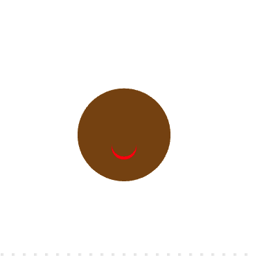

## Overlappende vormen

Een mond is een geweldige manier om emotie te tonen. Zal je gezicht een glimlach, frons of iets anders hebben? 

{:width="200px"}

Door vormen te overlappen, kun je vormen maken die je anders niet zou kunnen maken, je kunt bijvoorbeeld twee overlappende cirkels toevoegen om een glimlach te creëren.

--- task ---

Begin met een ellips om het gezicht weer te geven.

--- code ---
---
language: python line_numbers: true line_number_start: 12
line_highlights: 17-18
---
def draw(): # Put code to run every frame here background(255, 255, 255) # Add code to draw your face here no_stroke() fill(125, 75, 0) # Brown ellipse(200, 220, 150, 150) # Face

--- /code ---

--- /task ---

--- task ---

Stel de `vul`-kleur in voor je mond en teken vervolgens een `ellips`.

--- code ---
---
language: python line_numbers: true line_number_start: 12
line_highlights: 19-22
---
def draw(): # Put code to run every frame here background(255, 255, 255) # Add code to draw your face here no_stroke() fill(125, 75, 0) # Brown ellipse(200, 220, 150, 150) # Face fill(255, 0, 0)  # Red ellipse(200, 240, 40, 40) # Mouth

--- /code ---

--- /task ---

--- task ---

Stel de `vul`-kleur in, zodat deze overenkomt met de gezichtskleur, en teken vervolgens een tweede `ellips`.

Verander de `y` coördinaat van de tweede `ellips` naar een iets hogere positie voor een glimlach.

--- code ---
---
language: python line_numbers: true line_number_start: 18
line_highlights: 20-21
---

    fill(255, 0, 0)  # Red
    ellipse(200, 240, 40, 40) # Mouth
    fill(125, 75, 0) # Brown
    ellipse(200, 235, 40, 40) # Overlap

--- /code ---

--- /task ---

--- task ---

**Test:** Experimenteer met het wijzigen van de vulkleuren en -groottes van de ellipsen. Voer jouw programma uit om de resultaten te bekijken.

--- /task ---