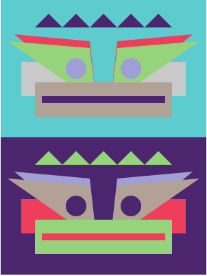

## Zrobisz to

Napisz kod Python, aby narysować twarz lub maskę za pomocą kształtów geometrycznych.

Tworzenie **sztuki geometrycznej** sięga starożytnej Grecji, gdzie wazony byłyby malowane wzorami złożonymi z kształtów. Artyści zaczęli używać kształtów do rysowania ludzi i zwierząt z kółkami dla głów, ciał trójkąta i linii dla nóg i ramion.

Co zrobisz:

+ Kreatywnie używaj kodu, aby stworzyć dzieło sztuki cyfrowej
+ Narysuj i umieść swoją sztukę za pomocą geometrycznych kształtów, współrzędnych i warstw
+ Zorganizuj swój kod za pomocą funkcji

--- no-print ---

### Masz pomysły?

Podejmiesz kilka decyzji projektowych dotyczących rodzaju twarzy, którą zrobisz i sposobu użycia kodu, aby uzyskać pożądany efekt.

--- task ---

Spójrz na te przykłady i zastanów się, jak zostały one wykonane z okręgów, elips, kwadratów, prostokątów i trójkątów.

** Kawaii owocowy **:
<iframe src="https://editor.raspberrypi.org/en/embed/viewer/fruit-face-example" width="400" height="710" frameborder="0" marginwidth="0" marginheight="0" allowfullscreen>
</iframe> [ Patrz wewnątrz ](https://editor.raspberrypi.org/en/projects/fruit-face-example){:target="_blank"}

** Stacked twarze **:
<iframe src="https://editor.raspberrypi.org/en/embed/viewer/stacked-faces-example" width="400" height="710" frameborder="0" marginwidth="0" marginheight="0" allowfullscreen>
</iframe> [ Patrz wewnątrz ](https://editor.raspberrypi.org/en/projects/stacked-faces-example){:target="_blank"}

** Maska plemienna **:
<iframe src="https://editor.raspberrypi.org/en/embed/viewer/tribal-mask-example" width="400" height="710" frameborder="0" marginwidth="0" marginheight="0" allowfullscreen>
</iframe> [ Patrz wewnątrz ](https://editor.raspberrypi.org/en/projects/tribal-mask-example){:target="_blank"}

--- /task ---

--- /no-print ---

--- print-only ---

### Masz pomysły?

Podejmiesz kilka decyzji projektowych dotyczących rodzaju twarzy, którą zrobisz i sposobu użycia kodu, aby uzyskać pożądany efekt.

Zbadaj przykładowe projekty powyżej, sprawdź, czy możesz zidentyfikować kształty używane do tworzenia ścian. Możesz kliknąć ** Zajrzyj do środka **, aby wyświetlić kod.

  

--- /print-only ---

