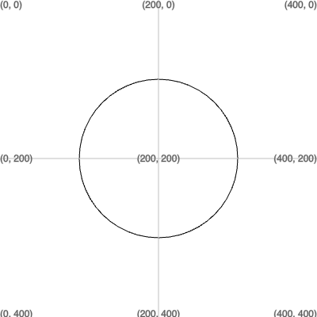

## Formato do rosto

Desenhe e pinte uma forma para o seu rosto ou máscara. Não adicione os outros recursos ainda, eles virão mais tarde.

{:width="200px"}

--- task ---

Decida o formato principal do rosto para sua máscara. Pode ser um círculo, uma elipse, um retângulo ou até mesmo um triângulo.

Adicione código à função `draw()` para desenhar um rosto ou máscara.

Este exemplo desenha um círculo preto no meio, mas cabe a você decidir qual forma e cor usar.

--- code ---
---
language: python filename: main.py - draw() line_numbers: true line_number_start: 10
line_highlights: 14, 15
---

def draw(): # Put code to run every frame here background(255, 255, 255)  # Change to your background colour

    # Add code to draw your face here
    ellipse(width/2, height/2, 200, 200)  # Circle in the middle
    
    grid()  # add a # to the beginning of this line to hide the grid

--- /code ---

[[[processing-python-ellipse]]]

[[[processing-python-rect]]]

[[[processing-python-triangle]]]

--- /task ---

--- task ---

**Teste:** Execute seu código e altere-o para obter o tamanho e a forma do rosto que você deseja.

--- /task ---

--- task ---

Escolha uma cor de traçado para o contorno e uma cor de preenchimento para a parte principal da forma.

[[[processing-stroke]]]

Se você não quiser um contorno, use `no_stroke()`.

--- code ---
---
language: python filename: main.py - draw() line_numbers: true line_number_start: 13
line_highlights: 14
---

    # Add code to draw your face here
    fill(255, 255, 0)  # Bright yellow
    ellipse(width/2, height/2, 200, 200)

--- /code ---

[[[generic-theory-simple-colours]]]

--- /task ---

--- task ---

**Teste:** Execute seu código e mude a cor até ficar satisfeito com ele.

--- /task ---

--- save ---
