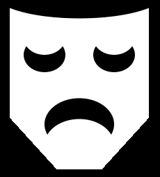

## Adicione uma boca

A boca é uma ótima maneira de mostrar emoção. Seu personagem terá um sorriso, carranca ou outra coisa? 

{:width="200px"}

--- task ---

Pense em que tipo de boca seu rosto precisa. A boca mais simples seria um círculo para parecer surpreso.

Você pode adicionar dois círculos sobrepostos para criar um sorriso ou uma carranca. Triângulos ou retângulos podem ser adicionados para os dentes.

--- /task ---

--- task ---

Adicione o código à sua função `draw()` para adicionar uma boca.

--- collapse ---

---
title: Crie uma boca a partir de círculos sobrepostos
---

Defina a cor `fill` para sua boca e desenhe uma `elipse`. Defina a cor `fill` novamente, desta vez para combinar com a cor da face, depois desenhe uma segunda `elipse`.

Altere a coordenada `y` da segunda `elipse` para uma posição ligeiramente mais alta para um sorriso ou uma posição ligeiramente mais baixa para uma carranca.

--- code ---
---
language: python
filename: main.py - draw()
---

    fill(0, 0, 0)  # Uma boca negra
    ellipse(200, 240, 15, 15)
    fill(255, 165, 0)  # Um rosto laranja
    ellipse(200, 235, 15, 15)  # Círculo superior

--- /code ---

--- code ---
---
language: python
filename: main.py - draw()
---

    fill(0, 0, 0)  # Uma boca negra
    ellipse(200, 240, 15, 15)
    fill(255, 165, 0)  # Um rosto laranja
    ellipse(200, 245, 15, 15)  # Círculo inferior

--- /code ---

--- /collapse ---

--- collapse ---

---
title: Crie uma boca usando retângulos
---

Os robôs geralmente são mostrados com bocas em forma de `retângulo`. Às vezes, as formas `retângulo` e `elipse` são usadas juntas para criar um emoji de careta ou para adicionar uma máscara facial.

Adicione o código para um `retângulo`e crie um `retângulo` menor dentro dele. Altere o `traço` e cores de `preenchimento` para complementar seu tema. Adicione formas de `elipse`, se necessário.

**Dica:** Lembre-se de colocar as formas de `elipses` acima do código do `retângulo` se quiser que elas fiquem atrás das formas `retangulares`.

--- code ---
---
language: python
filename: main.py - draw()
---
    # Máscara facial
    no_fill()
    stroke(255, 255, 255)
    ellipse(150, 250, 30, 30)  # Laço da orelha esquerda
    ellipse(250, 250, 30, 30)  # Laço da orelha direita
    fill(255, 255, 255)
    no_stroke()
    rect(150, 230, 100, 40)  # Grande retângulo branco
    fill(108, 200, 206)
    rect(152, 235, 96, 30)  # Retângulo azul menor

--- /code ---

--- /collapse ---

**Dica:** Adicione um comentário `# Boca` na linha antes do código da boca para ajudá-lo a encontrar facilmente o código da boca.

--- /task ---

--- task ---

**Escolha:** Você também pode adicionar vários dentes à sua boca usando `translate` para alterar a coordenada `x` após cada dente ser desenhado.

--- collapse ---

---
title: Use um laço para adicionar uma fileira de dentes
---

Adicione o código para criar um laço `for` que se repete para criar o número de dentes que você precisa.

Após cada dente ter sido desenhado, adicione o código `translate()` para a largura do dente.

Você também pode adicionar código para alterar a cor de cada dente.

--- code ---
---
language: python
filename: main.py - draw()
---

    # Boca
    fill(90, 110, 184)
    vermelho = 90  # Quantidade inicial de vermelho
    verde = 110  # Quantidade inicial de verde
    azul = 180  # Quantidade inicial de azul
    for i in range (0,6):
        rect(100, 300, 33, 50)
        fill(vermelho, verde, azul)  # Usa variáveis para controlar a mudança de cor em cada laço
        vermelho = vermelho+40
        azul = azul-30
        translate(33, 0)  # Mover ao longo da coordenada x pela largura de um dente

--- /code ---

--- /collapse ---

[[[processing-translation]]]

--- collapse ---

---
title: Use triângulos para adicionar presas
---

Crie um `retângulo` para usar como a linha da boca.

Adicione duas formas de `triângulo` para criar as presas. Altere as coordenadas `x` de cada canto para posicionar as presas em extremidades opostas da linha da boca.

--- code ---
---
language: python
filename: main.py - draw()
---
    # Boca
    fill(0)
    rect(170, 260, 60, 5)  # Linha da boca
    fill(0)
    triangle(170, 260, 180, 280, 190, 260)  # Dente esquerdo
    triangle(210, 260, 220, 280, 230, 260)  # Dente direito
--- /code ---

--- /collapse ---

--- /task ---

--- task ---

**Debug:** Talvez você encontre alguns bugs em seu projeto que precisem de correção. Aqui estão alguns bugs comuns.

--- collapse ---

---
title: Minha forma sobreposta sai do rosto
---

Se você usar duas formas sobrepostas para criar uma boca, certifique-se de que a forma que tem a mesma cor do rosto não saia do rosto. Se isso acontecer, altere a largura ou a altura da forma para que ela fique pequena o suficiente para caber dentro do rosto.

--- /collapse ---

--- collapse ---

---
title: Eu tenho muitos dentes
---

Não se esqueça que `range()` cria uma sequência de números começando em 0 e não em 1. Isso pode fazer diferença no seu código, dependendo de como você posicionou os dentes.

--- /collapse ---

--- /task ---

--- save ---
